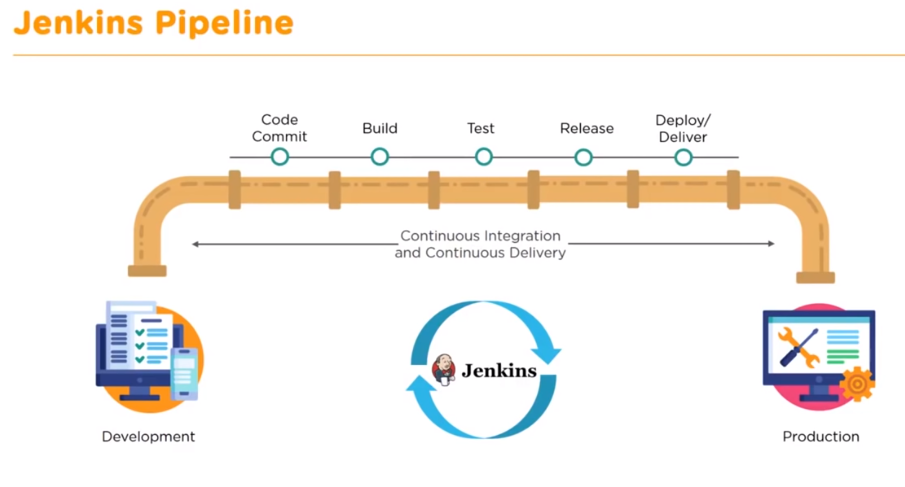
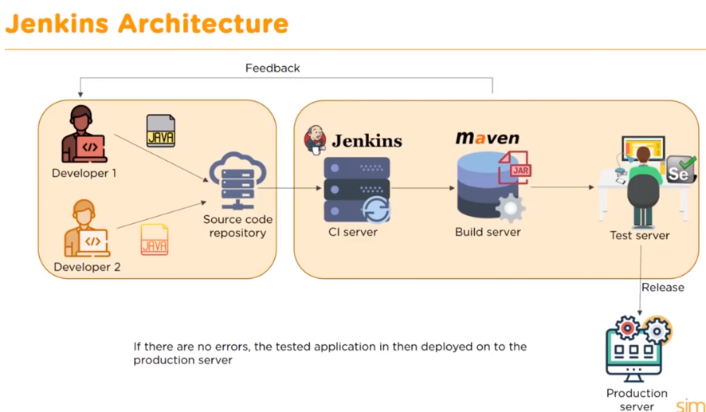
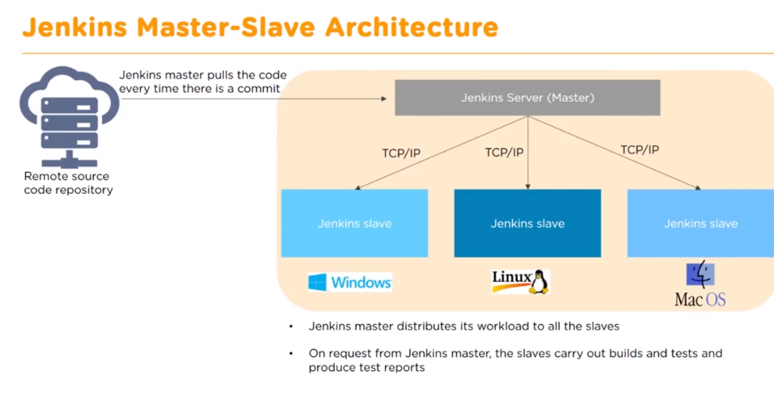

# What is Jenkins
it is a continuous integration tool that allows continuous development, test and deployment of newly created codes



# Architecture


# Master-Slave architecture
increasing fault talurence, and parallel build


SMTP port: 465

there are 2 types of roles
Role Based Access Plugin

* Project roles
* Global role


# pipeline in jenkins

some of the reference in jenkins/blog folder

Plugin install
Delivery Pipeline plugin

```groovy
pipeline {
	agent any
		stages {
			stage('git-Checkout') {
				steps {
				    git 'https://github.com/simplilearn-github/Pipeline_Script.git'
					echo "Git checkout 👌";
				}
			}
			
			stage('Build') {
        steps {
			    bat 'Build.bat'
        }
			}

			stage('JUnit') {
				steps {
				    bat 'Unit.bat'
					echo "JUnit Passed Successfully!";
				}
			}

			stage('Quality-Gate') {
				steps {
					bat 'Quality.bat'
					echo "SonarQube Quality gate passed successfully";
				}
			}

			stage('Deploy') {
				steps {
				    bat 'Deploy.bat'
					echo "Deployed Successfully!!!!!";
				}
			}
		}

	post {
		always {
			echo 'This will always run';
		}

		success {
			echo 'This will run only if successful';
		}

		failure {
			echo 'This will run only if failed'
		}

		unstable {
			echo 'This will run only if the run was marked as unstable'
		}

		changed {
			echo 'This will run only if the state of the pipeline has changed'
			echo 'For example if the pipleine was previously failing but is now successful'
		}
	}
}
```

```groovy
pipeline {
	agent {
    label 'windows-agent'
  }
	stages {
		stage('git-Checkout') {
			steps {
			  git 'https://github.com/simplilearn-github/Pipeline_Script.git'
				echo "Git checkout 👌";
			}
		}
		
		stage('Build') {
		  steps {
        sh 'echo "Nice"'
      }
		}
		stage('JUnit') {
			steps {
				echo "JUnit Passed Successfully!";
			}
		}
		stage('Quality-Gate') {
			steps {
				echo "SonarQube Quality gate passed successfully";
			}
		}
		stage('Deploy') {
			steps {
				echo "Deployed Successfully!!!!!";
			}
		}
	}

	post {
		always {
			echo 'This will always run';
		}

		success {
			echo 'This will run only if successful';
		}

		failure {
			echo 'This will run only if failed'
		}

		unstable {
			echo 'This will run only if the run was marked as unstable'
		}

		changed {
			echo 'This will run only if the state of the pipeline has changed'
			echo 'For example if the pipleine was previously failing but is now successful'
		}
	}
}
```

# Parallel
```groovy
pipeline {
	agent none
		stages {
			stage('Non-Parallel stage') {
				agent {
					label 'master'
				}

				steps {
					echo 'This stage will be executed first'
				}
			}


			stage('Run tests') {
				parallel {
					stage ('Test On Windows') {
						agent {
							label 'Windows-agent'
						}

						steps {
							bat "a.exe"
						}
					}

					stage ('Test On master') {
						agent {
							label "master"
						}

						steps {
							echo "Task on master"
						}
					}
				}
			}
		}
}
[Github Link](https://github.com/simplilearn-github/Pipeline_Script)


[K8s with Jenkins](https://blog.knoldus.com/how-to-setup-jenkins-build-agents-on-kubernetes-pods/)