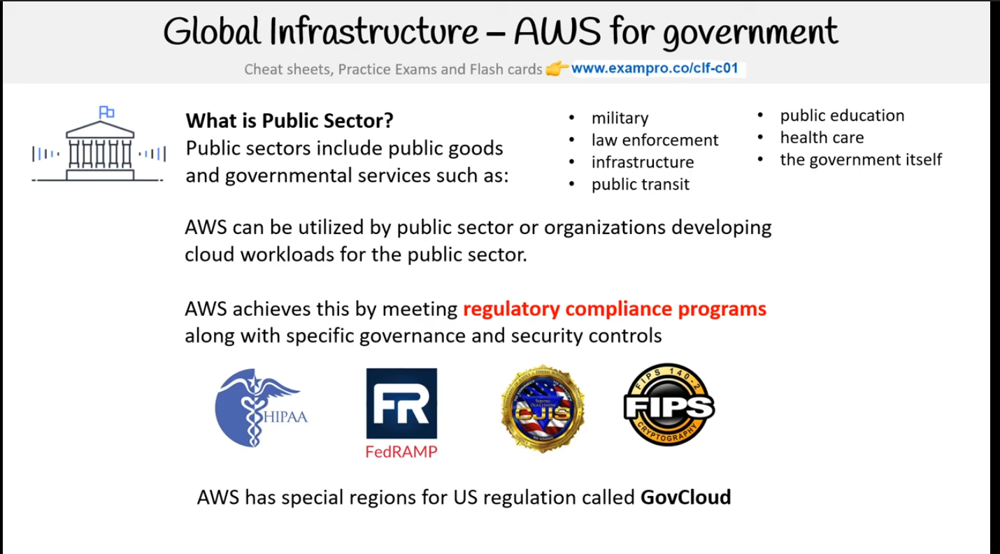
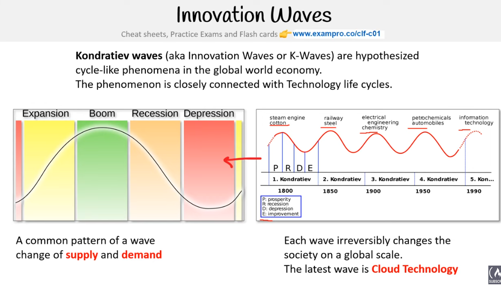
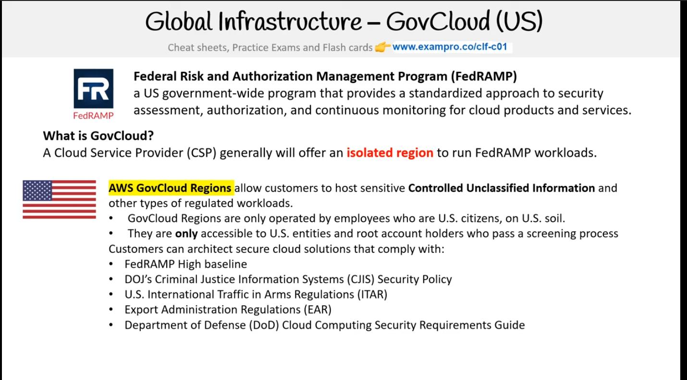
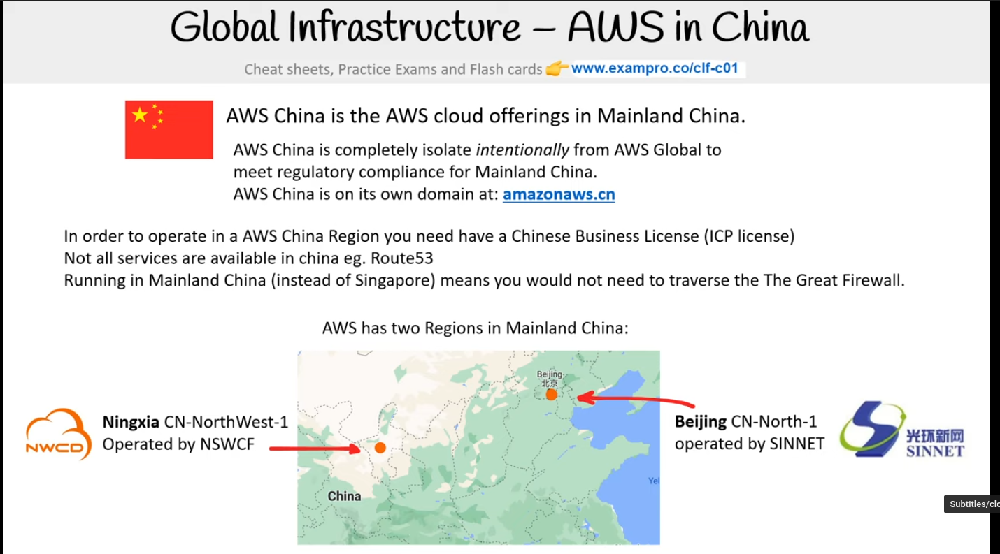
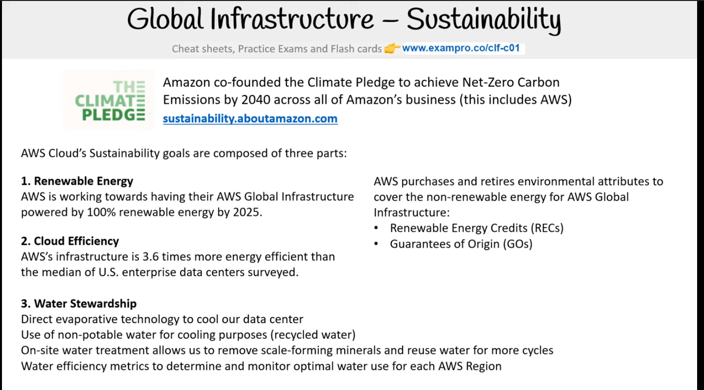
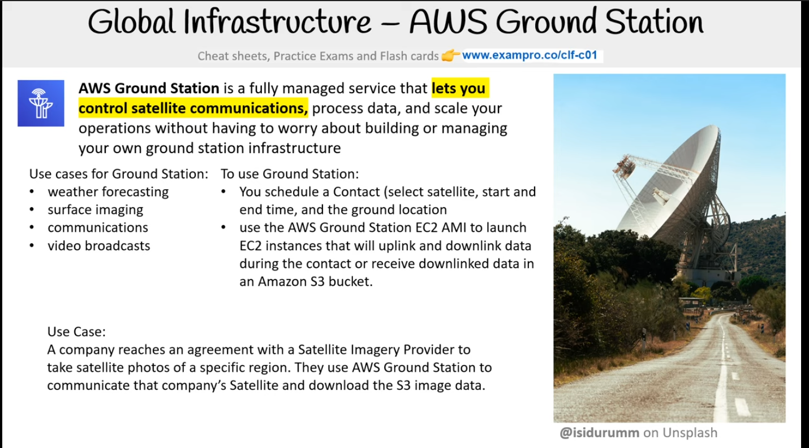
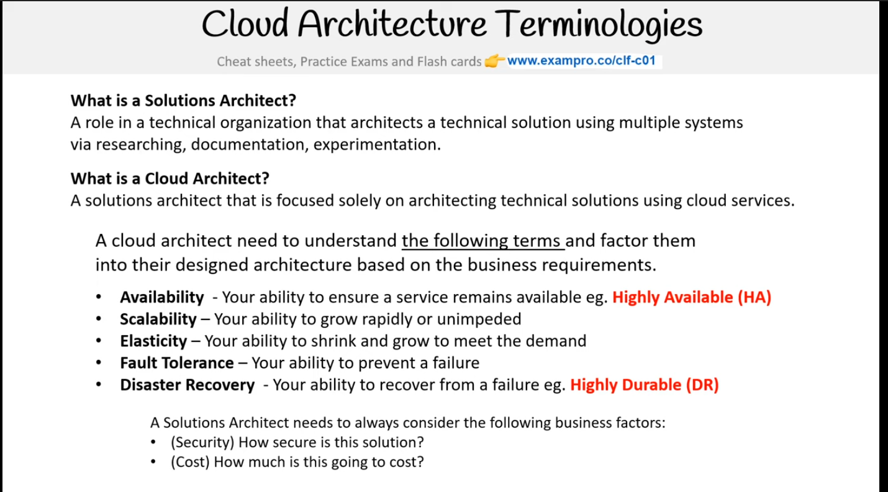
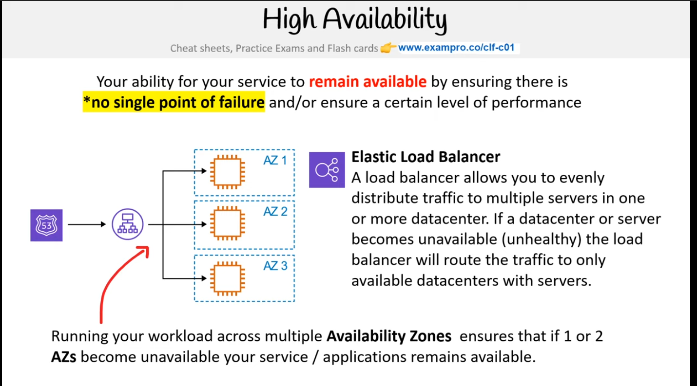
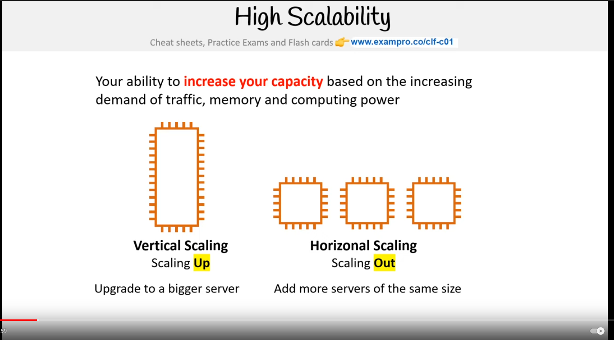
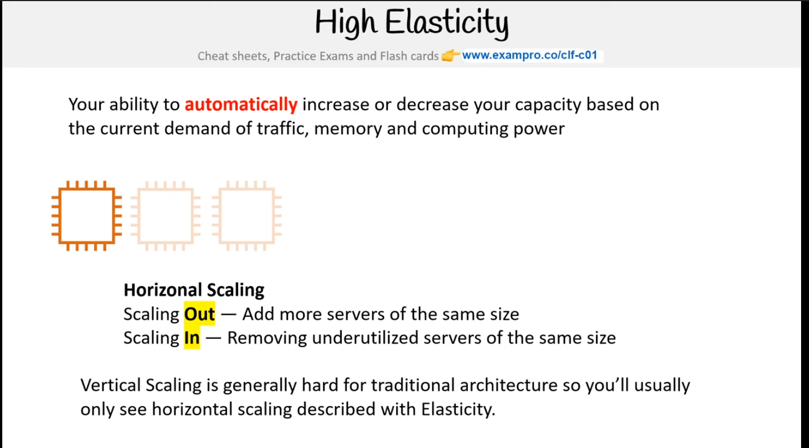

# AWS Certified Cloud Practitioner(CLF-C01)

## All the Certificates


# What is Cloud Computing


## Evolution


> **NOTE** CSP -> Cloud Service Providers

## What is a CSP?


## Landscape


## Garter Magic Quadrant


# Types of Cloud Service (Cloud Computing)


# Dedicated or Physical server

Used for High performance task like ML, Systems Every close together
what kind of vertiualization you want

# VMs
It virtualizes the Physical computer


# Containers

It Virtualizes the OS

# Functions


# Types of Cloud Computing


# Types of Cloud


# Budgets
⚠️Beware that some servrices also charged
They both creates a SNS(it is just a service notifier where it sends a email to notify about bills, anomilies)
* Biling console(It has forecasting)
* Cloud Watch(Billing allarms (They dont have forecasting))
Both has its special utulity


# Innovation Waves


# Regions & Zones

The subnet is like avability zone
Regions
+------+  
| (AZ) |
+------+
AZ = avability zone

In **EC2** we select the avability zone
In **S3** bucket we dont select the avability zone but select the region
in **Cloudfront** we are not selecting the region we are giving the geogrphic zones(like asia, north america)
in **IAM** we dont specify anything as it is global

VPC is regionaly scoped service meaning it sits across all availability zones within that region
subnets are availability zone scoped means they sit in individual avilibility zones
multiple subnets in different availbility zones in a single VPC. multiple VPCs in the same region or diff region however NO VPC can span multiple regions
VPC's can connect to each other means VPC connectoins can span multiple regions
so we have ability to peer VPC together to expand our environment if necssary

the use of route tables, network interfaces and interface endpoints gives complete control over the security configuration and connectivity of resources in our VPC

by default all incomming connections are **BLOCKED!!** & all outgoing connections are **ALLOWED!!**

to distribute traffic among a single region we need elastic load balancer(ELB)
to distrubte traffic among different regions er need Amazon Route 53

undifferenciated heavy lifting that is we manage all the physical stuff for you

a user is a permenanent identity and roles are temporary identity


<!-- 














 -->

# Cloud architecture
to have highly available in EC2 where every instance is one AZ so we need to have deploy EC2 with different AZs and have elastic ip where load balcned
we can instead use elaastic beanstalk

place the info here

# IAC
Cloud Formation
```yml
# Yaml for the cloudformation in s3 bucket
# template.yaml
AWSTemplateFormatVersion: "2010-09-09"
Resources:
  HelloBucket:
    Type: 'AWS::S3::Bucket'
Outputs:
    HelloBucketDomain:
        Description: The domain of the bucket
        Value: !GetAtt HelloBucket.DomainName
```
```sh
# here we are using AWS cli to create the cloudformation stack in the template
aws cloudformation create-stack \
  --stack-name myStack232 \
  --template-body file://Demo_files/template.yaml
```

cloud development Kit
it is cloudformation but we use programming language
[https://github.com/aws/aws-cdk/blob/main/README.md]()

cloud9 is a IDE in aws


# Management and deployment
access keys


# documentations

you can contribute in the docs
aws labs github
[Github Link](https://github.com/awslabs)

# responsibility
IaaS
PaaS
SaaS
FaaS

AWS CLoud trail logging events