# AWS Certified Cloud Practitioner(CLF-C01)

## All the Certificates

# What is Cloud Computing
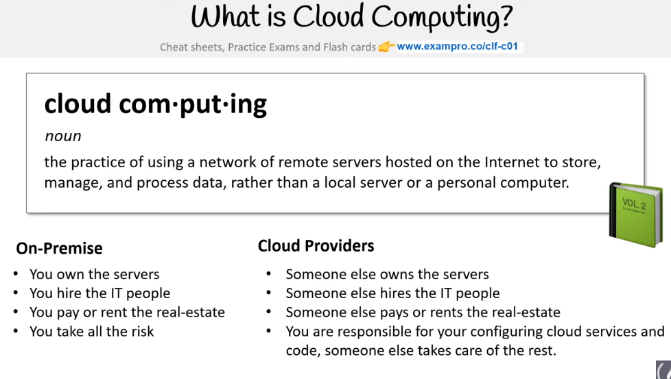

## Evolution
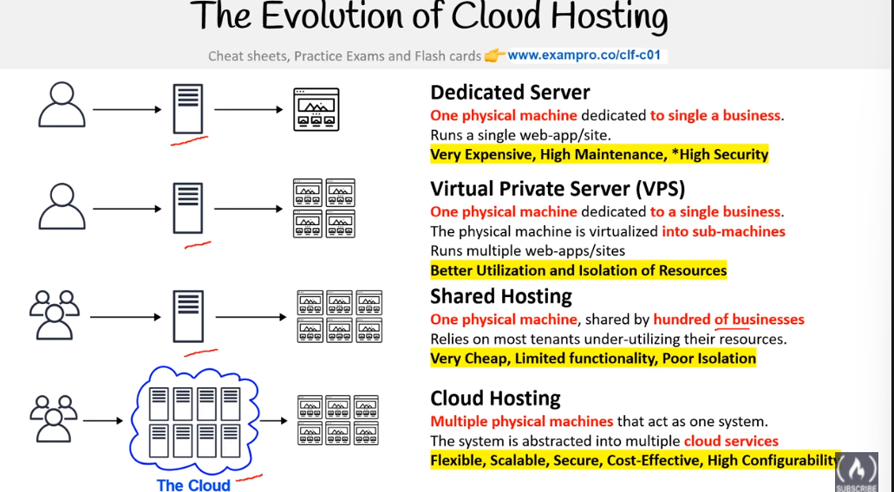

> **NOTE** CSP -> Cloud Service Providers
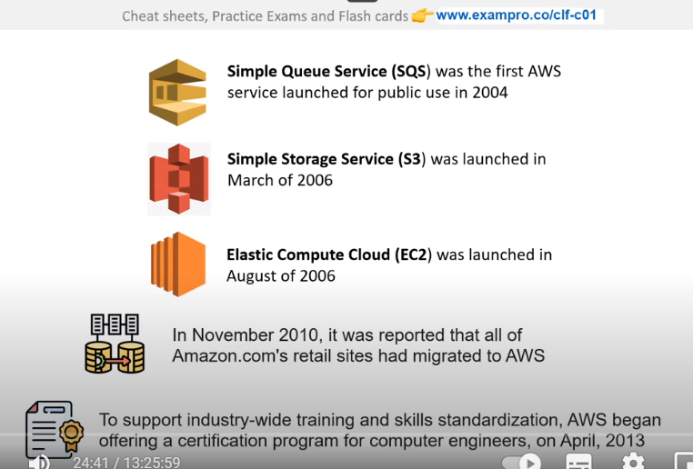
## What is a CSP?
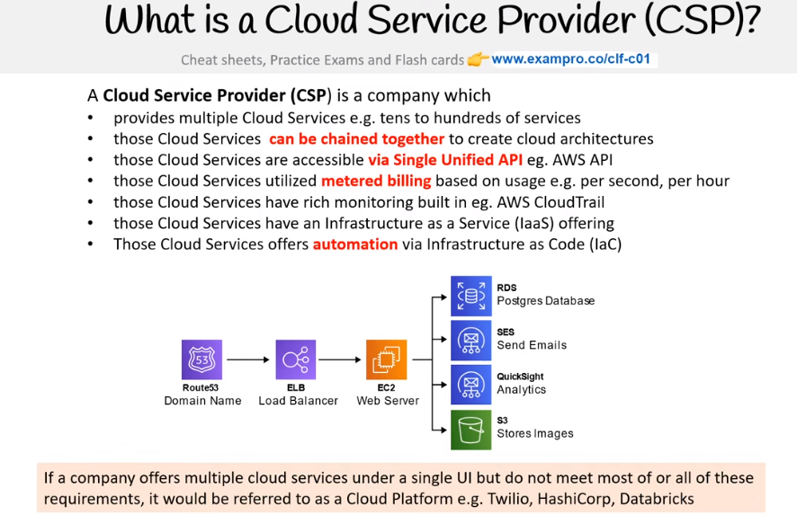

## Landscape
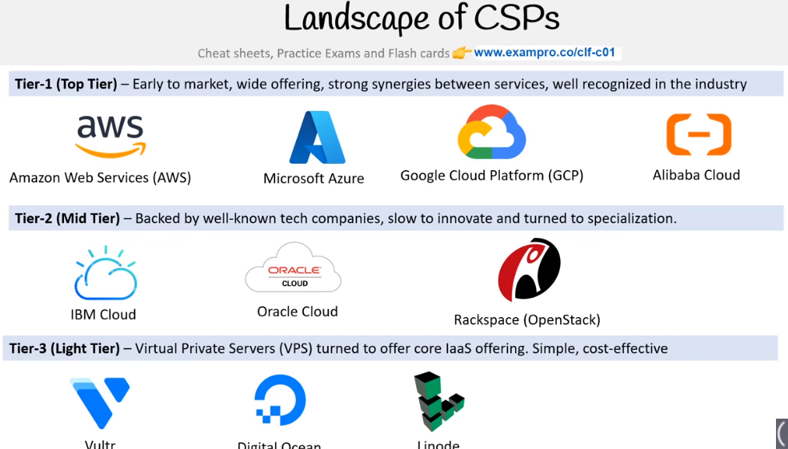

## Garter Magic Quadrant
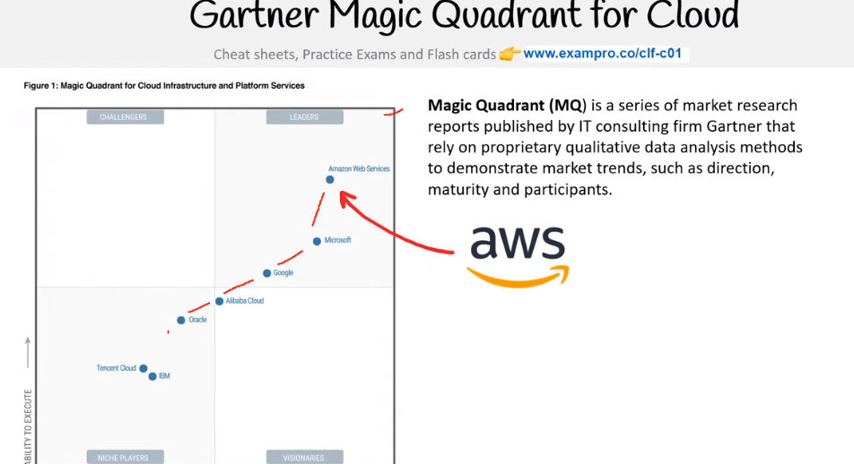

# Types of Cloud Service (Cloud Computing)
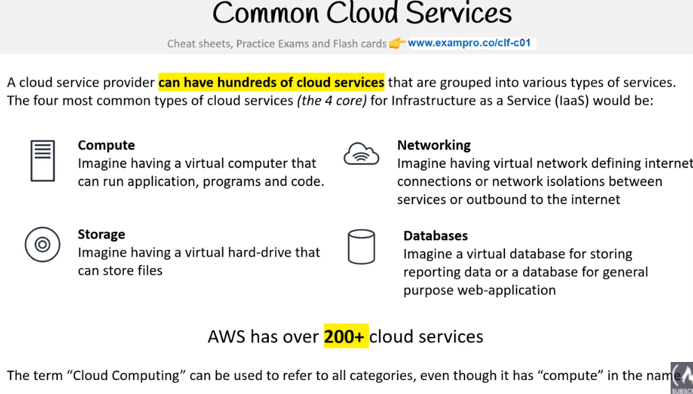

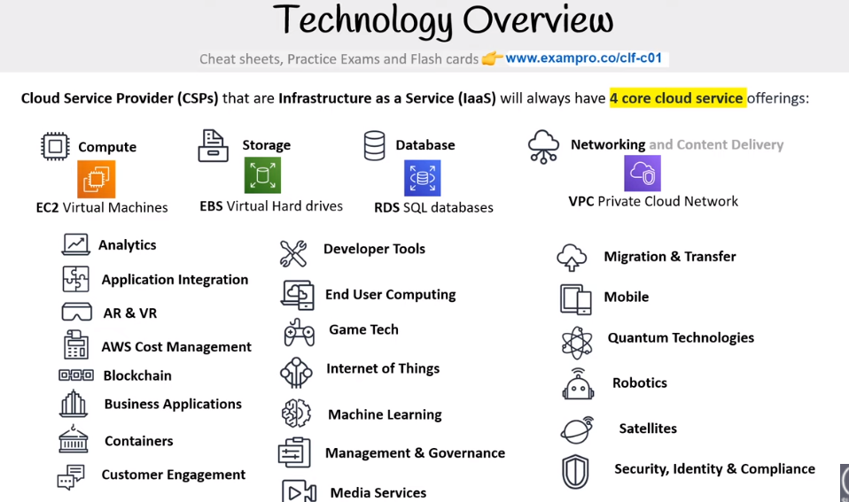

# Dedicated or Physical server
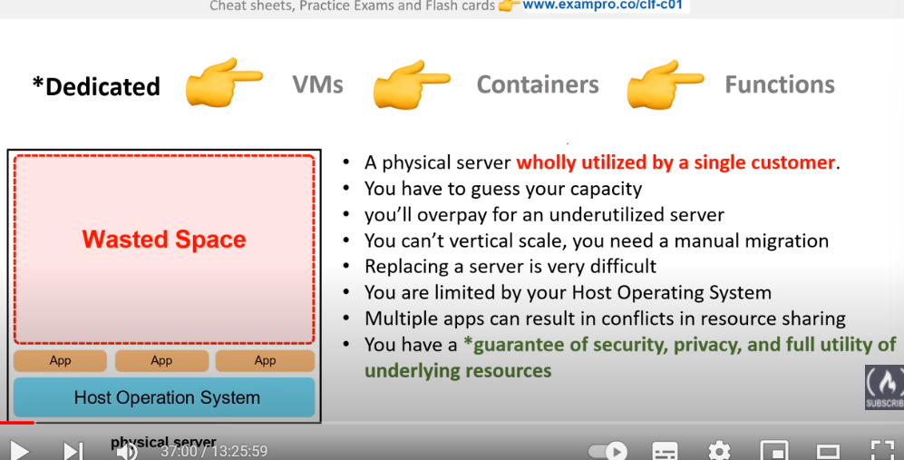
Used for High performance task like ML, Systems Every close together
what kind of vertiualization you want

# VMs
It virtualizes the Physical computer
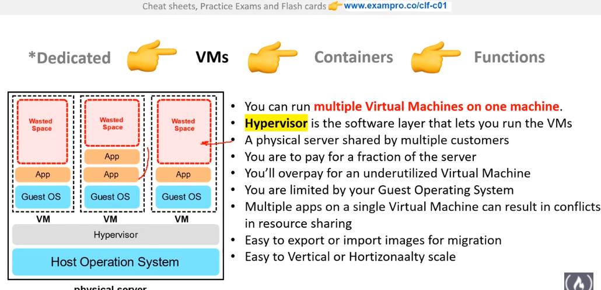

# Containers
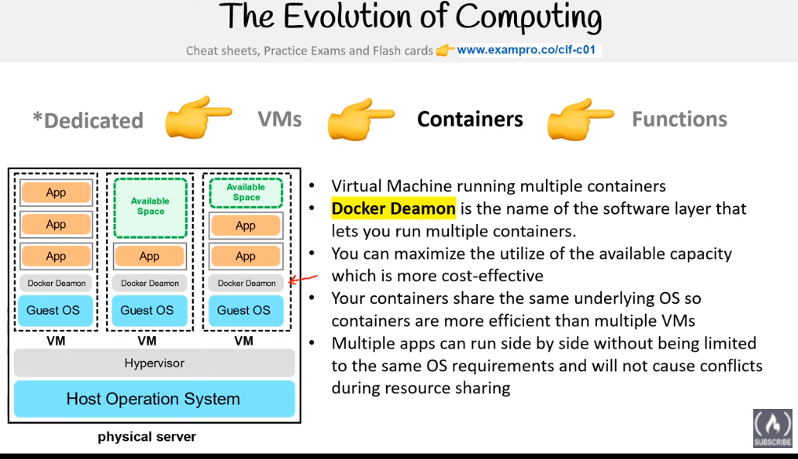
It Virtualizes the OS

# Functions
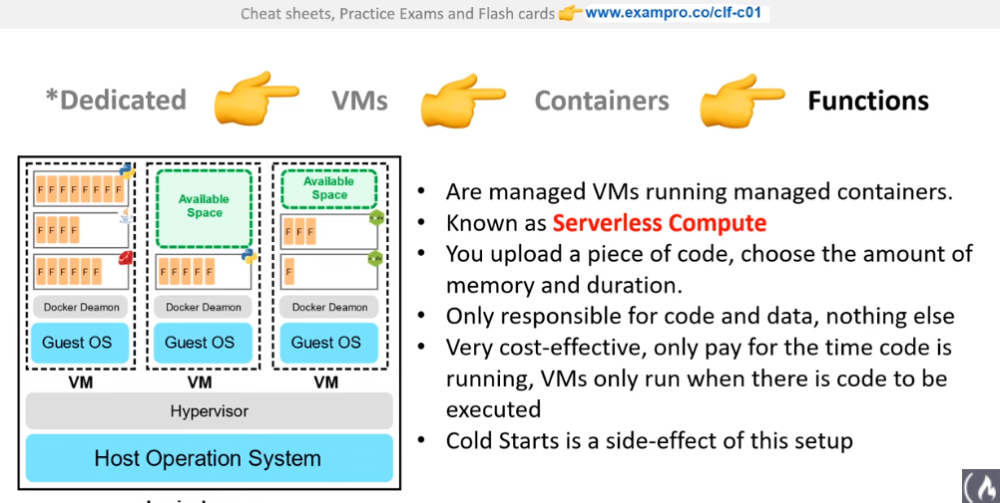

# Types of Cloud Computing
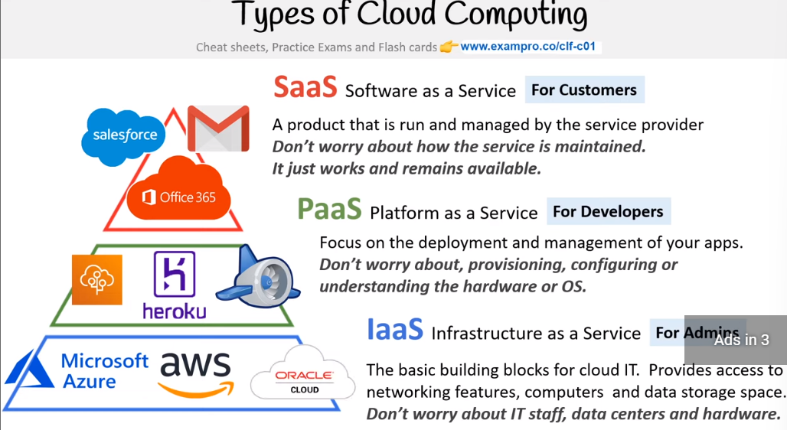

# Types of Cloud

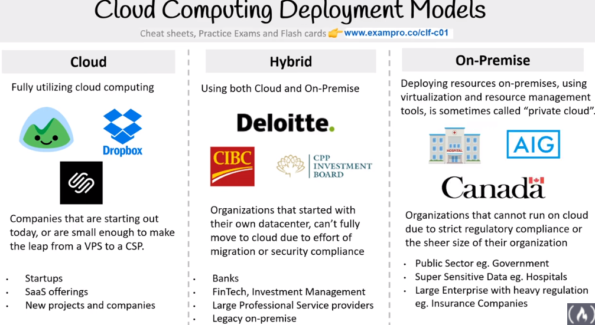

# Budgets
⚠️Beware that some servrices also charged
They both creates a SNS(it is just a service notifier where it sends a email to notify about bills, anomilies)
* Biling console(It has forecasting)
* Cloud Watch(Billing allarms (They dont have forecasting))
Both has its special utulity