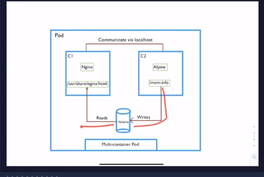
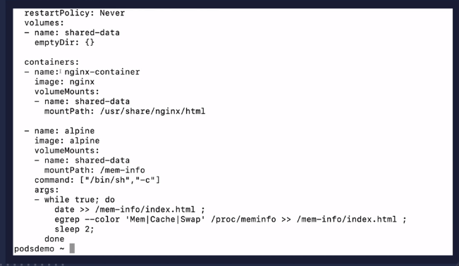
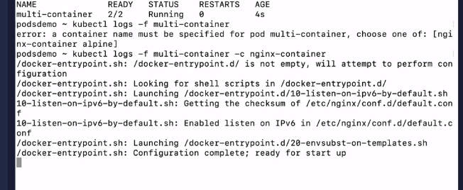
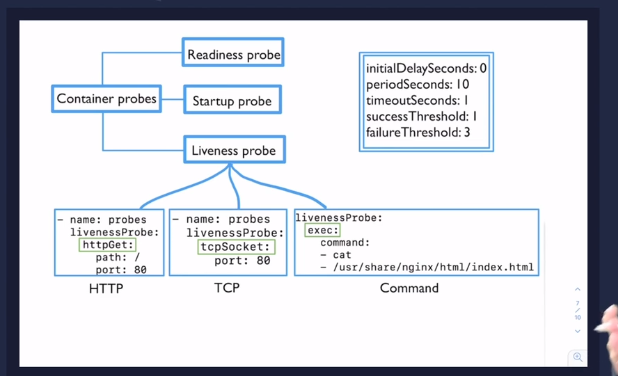
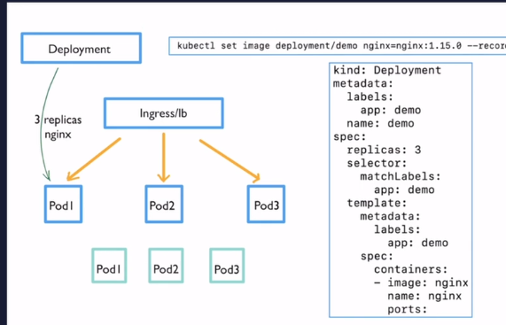
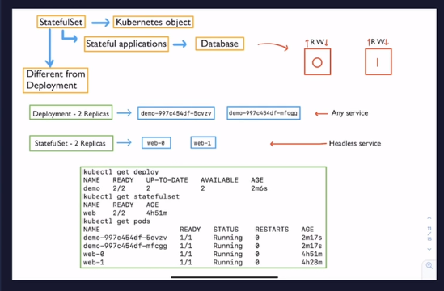
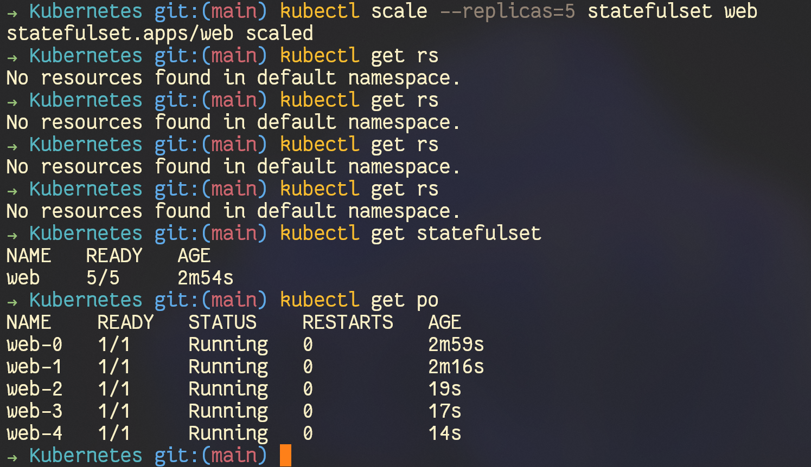
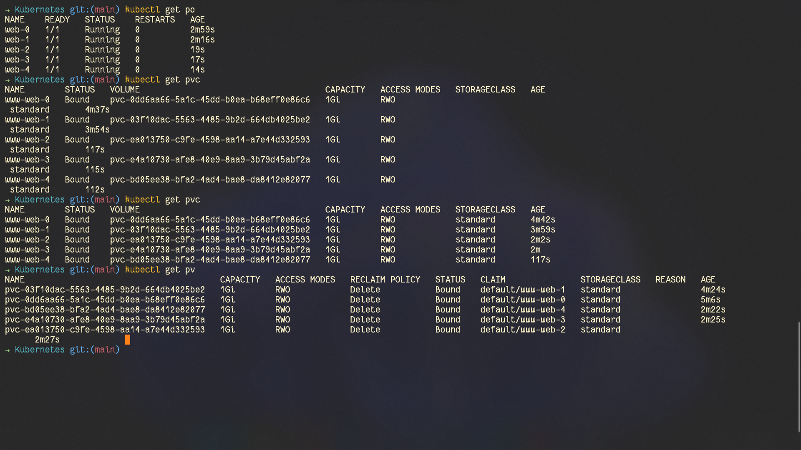

# Pod lifecycle


kubectl apply -f <> [kubectl]()  ➡️(((YAML->JSON)))➡️   [api server]()

[api server]() authenticate uing kubeconfig auth and checks whether the user is authorized or not to a particular functionality (i.e. creation, deletion) ➡️➡️ After all that the data gets persisted to the [etcd]() 😇 here `state` becomes [Pending]()

Now the [Scheduler]() comes and it finds a best match of node where it has to be spanned (i.e. iterate through all the nodes in the cluster to get the best possible based on the resources or images pulled or not ) 
after getting it sends the labels filled the `spec <node name>` & send it to the [api server]() now that particular request is also stored on the [etcd]() 😇 here `state` becomes [Container Creating]()

[api server]() Instructs the [kubelet]() of that particlar node  [kubelet]() is responsible to fetch the image from [image registry]() the [cri]() gets the ip attached to the pod which is send to the [api server]()
and again data is stored  in [etcd]() 😇 here `state` becomes [Running]()

Whenever the process dies too many times then 😇 here `state` becomes [Crash loop back off]()

and whenever the process succeded then 😇 here `state` becomes [succeeded]()

the pod is constantly checks for these:
---
## liveliness probe
/health

## Readiness probe
/ready
---
if it fails then 😇 here `state` becomes [Crash loop back off]()


## Hooks

actions that you want to before the conatiner starts

### just before it stops
pre-stops hooks

### just after it starts
post-start hook

### init container
it runs before running the main container

---

# Init containers
are the container that run to completion and runs before the main containner starts
## use case
to change the file structure or something like that
used to limit the attak surface
it can be used to delay the start up of the main container so that certain checks are done before hand

first all the init container are done then only the main container will start
there is 🚫 liveliness, readiness

# Multiple container pod
use cases

* sidecar can be used to log the main application 
* helper contaners can used to act as a reverse proxy
  to get the static files




```shell
kubectl exec -it multi-container -c nginx-container sh
```



[startup probe]() its a special kind of liveliness probe
where it halts the execution of other probes first the probe is executed unless it gets completed; if ✅ then [liveliness]() will continue execution

## HTTP
```yml
- name: probes
  livenessProbe:
    httpGet:
      path: /
      port: 80
```

## TCP
```yml
- name: probes
  livenessProbe:
    tcpSocket:
      port: 80
```

## HTTP
```yml
- name: probes
  livenessProbe:
    exec:
      command:
      - cat
      - /usr/share/nginx/html/index.html
```

* `initialDelaySeconds` - before any probes starts time to delay its start cheeck
* `periodSeconds` - time b/w one probe check to another
* `timeoutSeconds` - [kubelet]() will wait for this much time for response
* `successThreshold` - how many time we want the probe to be successful to mark as `SUCCESSFUL`
* `failureThreahold` - how many failure will make kublet to restart the container

# Deployments

here you can specify the number of replicas of pods 

## what happens when the image is changed in the deployment
```shell
kubectl set image deployment/demo nginx=nginx:1.15.0 --record
```


as here the 3 pods are connected to the load balancer and ignress control
as soon as we executed the command
a new 4th pod is created which then has to pass all the probes checks(i.e. liveliness, readiness)
then only one of the pod is sent request to terminate  as the pod is serving some amount of traffic
there is something called [Termination Grace Period]() default=30s after this timeperiod the connection is removed and he new reqests are trafficed to the new pod having new image 🙂

like these happens to all the pods having old images

[[[THIS IS ROLLING UPDATE STRATUGY]]]

```shell
kubectl create deployment demo --image=nginx --replicas=3 --port=80

kubectl get deploy

kubectl rollout status deployment demo

# by default the replicas set are created during creation of deployments
kubectl set image deployment/demo nginx=nginx:1.15.0 --record
```

## rollback
```shell
kubectl set image deployment/demo nginx=nginx:1.15.adf --record
kubectl get rs
kubectl rollout history deployment demo
```
  deployment.apps/demo
  REVISION  CHANGE-CAUSE
  1         <none>
  2         kubectl.exe set image deployment/nginx nginx=nginx:1.15.0 --record=true
  3         kubectl.exe set image deployment/nginx nginx=nginx:1.15.as --record=true
```shell
kubectl rollout undo deployment demo --to-revision=2
```


## scaling

```shell
kubectl scale deployment demo --replicas=5
```

# Statefulsets

these are required by the stateful app like databases

in deployment if the databases have 3 pods then they have 3 differenct hash
if we have to read from the database the ✅
if write to it inconsistency ❌

so ststafulset required



where the statful will maintains a stiky identy (i.e. all the nodes of the pods will be predictable)

if the name is : web
then the pods will be web-0, web-1 ..., web-(n-1)like this

Differences with deployment
* names are predictable
* unless the previous pods is [READY]() then only new pods will not even get start creating
* require us to create these in [Headless service]()
because in any service the control goes any other pods as well
so in headless service each pod gets a [Unique ID]() which can be refered during replication 

[Persistent Volume Claim (PVC)]() , [Headless service]() has to be created by the USer

[PVC]() --will get attached to ->>>> [PV]() 

web-0, web-1, web-2, ...
--->>>>> insertion 
<<<<---- deletion

```shell
kubectl get statefulset
kubectl describe statefulset web
kubectl scale --replicas=5 statefulset web

kubectl get pvc # it just got created
```



all the pods have its own dns service

```shell
kubectl exec -it web-<> -- bash
```
\# curl <pod_name>.<service_name>.<namespace>.svc.cluster.local

## scaling down
```sh
kubectl scale --replicas=1 statefulset/web
```

So a persistent volume (PV) is the "physical" volume on the host machine that stores your persistent data. A persistent volume claim (PVC) is a request for the platform to create a PV for you, and you attach PVs to your pods via a PVC

# daemonset

copy of a pod runs on all or some pods
whenever a new node joins same copy is spined over there
and whenevere node gets deleted the pod also gets deleted

it controlled by the daemon-set controller on all the pods

but it is not schedulabe in master node

```sh
kubectl get ds -A
```
kube-proxy runs on all the nodes including the master node

## Example of use cases
* logs from all the nides
* daeomons on all the nodes
* specific scripts when a new node is created
* node monitoring
