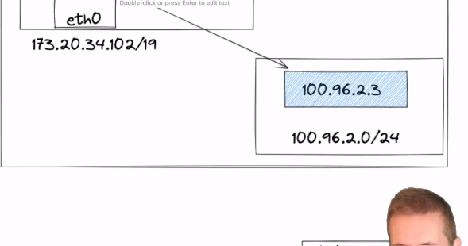

# Discussion about the networking

LAN network


Basics of TCP/IP protocol


Here in the LAN example
* as soon as the device gets connected it is assigned an IP address by the Router using *DHCP*
* these IP's are local to the LAN not outside internet
* common starting of these IPs are
  - 192.168..
  - 10.0..

* Router will get an ip address (internal) and external ip (provided by your ISP) for outside world

Basically moving from external ip(router) to the local network devices IP is known as [NAT]() `N`etwork `A`ddress `T`ranslation

it change the source and destination IP and modifies it so it can transfer through the network back to the correct target

*Everything can change not the `MAC` address*

so router has an internel routing table 
so from where it will search for the given IP what is the corresponding `MAC`
this is known as [Forward Routing]()

Every device must have some form of [NEC]() `N`etwork `E`nabled `C`ontroller
wherether it is physical or virtual device

# Container to Container networking in K8s


## Concept Linux host
1. there is a eth0 device for network device IN/OUT of the VM
2. on top of this eth0 there is [Network NameSpace]() - ability to partition the network layer into isolated stacks per process
3. the Pod has its own network ns as `mypodns`
  file directory path having a mountable point for the processes from our containers
  ```bash
  /var/run/netns/mypodns
  ```
4. relay on the docker network commands
  ```bash
  -net=container:function
  ```
  so that they contianer can connect to the ns and in turn is connected to the root ns so then is connected to the outside world and also the containers can communicate with each other through `mypodns` asif they were in localhost

# Pod to pod networking in K8s


1. new kind of device called [veth pair]() - virtual ethernet device which can be used like a patch cable to connect 2 different ns together
  [veth0]() represent [eth0]() inside [root ns]()
  [veth1]() represent [eth1]() inside [root ns]()

2. L3 virtual linux switch called [Linux Bridge]() its part of root ns - purpose to from specting the data frames from the incomming packets from the container and forwarding to the correct address

container -> eth0 -> veth0 -> bridge{it will decapsulats and looks at the dataframe to inspect the target IP address  and will check to see if there is IP address corresponds to MAC address in its lookup table} is bound to ta network interface if it finds a recirever on this network namspace that matches the target will forward the data packet and [add the MAC address](#addition-of-mac-address-in-the-bridge) if doesnt exists

## addition of MAC address in the bridge
it will perform a broadcast to every device on this network using arth protocol and who every responds will be assigned MAC addres  bound to the IP addres to the incomming dataframe

# Node to Node networking in K8s


as the bridge failed to resolve it then goes out to the cluster netowrk where it finds the node and then veth0 -> eth0 -> containe same process 

# Networking CNI

Using `Flannel`


using node - node inside same cluster



here the linux brodge is `docker0 bridge`
`fannel0` is like a network device which tunnels the requests data packets between [user land]() and [kernel land]()
[flanneld]() - will setup the fannel routing table if the data packet is part of this network then it is recieved by it
it then goes inside the kernel `kernel` makes its best attempt but is forwards back to the flanneld daemon process

flanned queries from the etcd for the subnet range of the target host ip then that subnet range can be resolved to the unserlaying VM VPC level address then uses UDP send to the node in question and that then is intercepted by flanneld running in that node which performs the inverse activity

---