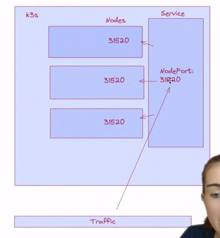

# K8s Services


## Types
* [ClusterIP](#clusterip)
* [NodePort](#nodeport)
* [LoadBalancer](#loadbalancer)
* [Headless Service](#headless-service)

## ClusterIP
* it is the default type
* access within cluster

```yml
# service.yml
apiVersion: v1
kind: Service
metadata:
  name: node-application
spec:
  type: ClusterIP # if dont write then also cluterip
  ports:
    - port: 3000
      targetPort: 8080 # this is optional as selector will tell which port of container is available to be forwarded
      protocol: TCP
      name: web
  selector:
    run: node-application
```

### to get endpoints
```bash
kubectl get endpoints -n <ns>
```

## NodePort

```yml
# service.yml
apiVersion: v1
kind: Service
metadata:
  name: node-application
spec:
  type: NodePort
  ports:
    - port: 3000
      targetPort: 8080
      protocol: TCP
      name: web
  selector:
    run: node-application
```
* ports (30000 to 32000)
* it is used to route the traffic
* how to connect to nodes *dynamically*

## Headless Service
here will not specify any port just like nodeport
```yml
# service.yml
apiVersion: v1
kind: Service
metadata:
  name: node-application
spec:
  type: None
  ports:
    - port: 3000
      targetPort: 8080
      protocol: TCP
      name: web
  selector:
    run: node-application
```
These are used not just in k8s but also outside of k8s scope manu custom solutions

`These are all within k8s cluster`

## LoadBalancer
The load balancer tracks the availability of pods with the Kubernetes Endpoints API. When it receives a request for a specific Kubernetes service, the Kubernetes load balancer
it basically way to access outside world to the nodes or pods in k8s cluster

It is quick way to enable this other options(Prefered) are [ingress](), [service mesh](), [linkerd]()


```yml
# service.yml
apiVersion: v1
kind: Service
metadata:
  name: node-application
spec:
  type: LoadBalancer
  ports:
    - port: 3000
      targetPort: 8080
      protocol: TCP
      name: web
  selector:
    run: node-application
```

here we are getting the external ip


here it has access to all the ports of [pods]() so if one goes down the connection is not down😎👍🏼

Additionaly it has selected a daemon set
of these different [pods]()
