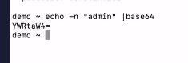
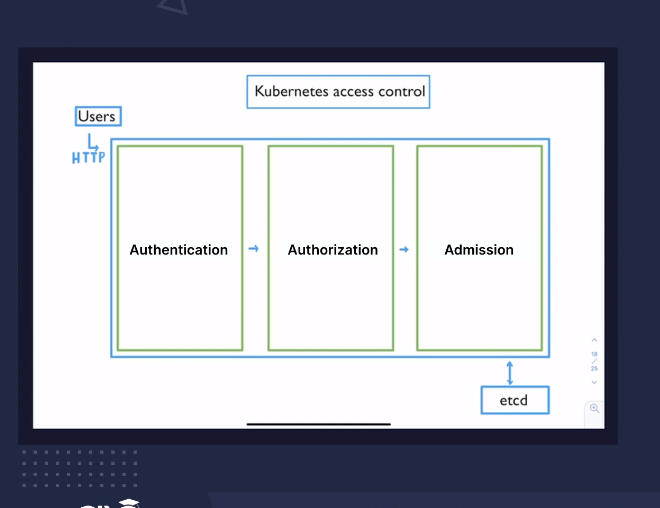
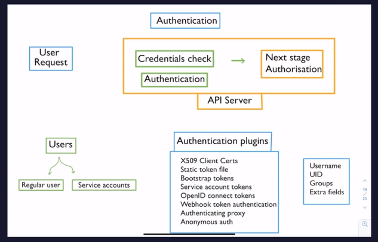
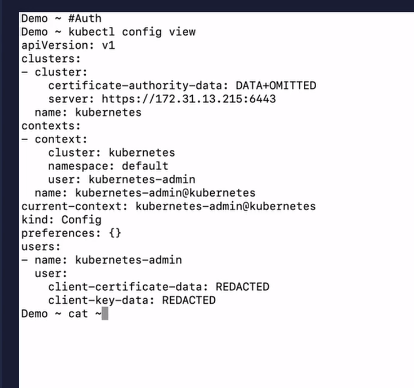
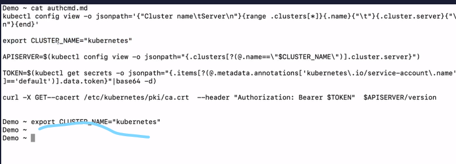
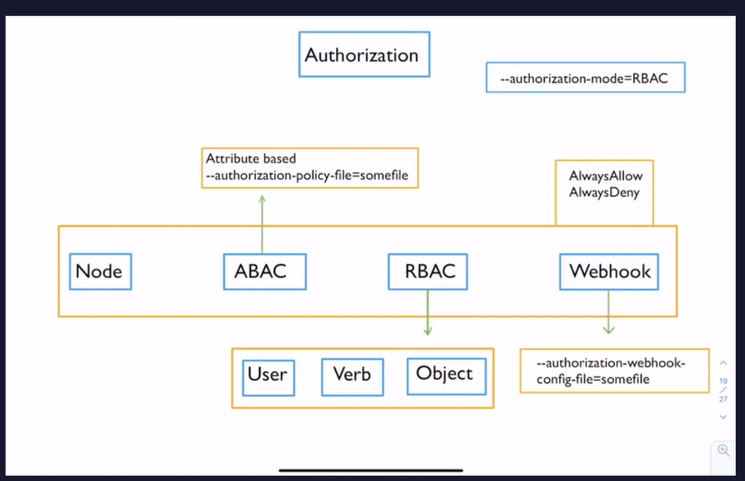
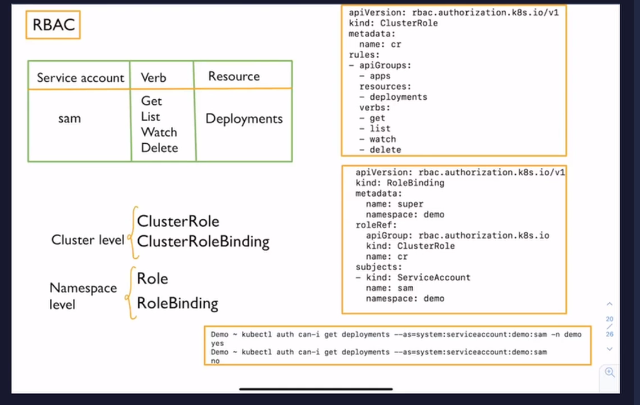

# Security

## ConfigMaps

### .prop file
```bash
# creating test configMap from a file
kubectl create configmap test --from-file=file.prop

kubectl describe cm test
```

### env files
sometimes we have multiple key value in a file want to store it in a seperate datas
using [env files]()

```bash
# creating test configMap from a file
kubectl create configmap test2 --from-env-file=env.prop

kubectl describe cm test2
```

### using liternal
```bash
kubectl create cm demo-my-name --from-literal=name=dipankar
```

## using ConfigMap

file = Kubernetes/secrets/demo-from-cm.yaml

## Secrets

### using yaml way

sec.yml

### using imperiative way
```bash
kubectl create secret generic admin --from-literal=admin-user=admin
kubectl create secret generic dev --from-literal=dev-user=dev
```

## Access


## Authentication



Regular user is not managed by k8s even the credential checks by the external user managemetn system

Service accounts are k8s objects where k8s API handles them
each of service account has SECRET -> having token which is used for authentication

there is a user info which gets attached to each requests
["Username", "UID", "GRoups", "Extra fields"] service users get this by natively K8s ; but the regular user get this from the external authentication


then authentication passes all the above info is passed to the authorisation


## authentication demo


```bash
kubectl config view
```


## Next is authorization


```bash
--authorization-mode=RBAC
```
Node : special peurpose authorization which allows Kublet to perform API operations

ABAC : attribute based access control
also along with --autoization-policy-file=somefile.json

RBAC : `R`ole `B`ased `A`ccess `C`ontrol
user *has* object control
user can do on what object

Webhook : it is external service that is called by the apiserver and then it decides whether the request is allowed or not
its a simple HTTP callback
using authorization-webhook-config-file=somefile

AlwaysAllow / AlwaysDeny

## RBAC


```bash
$ kubectl create ns demo 
$ kubectl create sa sam -n demo
$ kubectl create clusterrole cr --verb=get,list,watch,delete --resource=secrets,pods,deployments
$ kubectl create rolebinding super --serviceaccount=demo:sam -n demo --clusterrole=cr

[#$% link till where]()


$ kubectl run demo --image=nginx --serviceaccount=sam -n demo

$ TOKEN=$(kubectl describe secrets "$(kubectl describe serviceaccount sam -n demo| grep -i Tokens | awk '{print $2}')" -n demo | grep token: | awk '{print $2}')
$ kubectl config set-credentials test-user --token=$TOKEN
$ kubectl config set-context demo --cluster=demo-k8s --user=test-user
$ kubectl config use-context demo
```
4 resources can be created
1. cluster role
2. cluster role binding
3. role
4. role binding

Can be used together
[1]() <<--✅-->> [2]()
[3]() <<--✅-->> [4]()
[1]() <<--✅-->> [4]()

[3]() <<--❌-->> [2]()

role binding [or] cluster role binding can be created after first 3 commands
[#$% link till where]()

