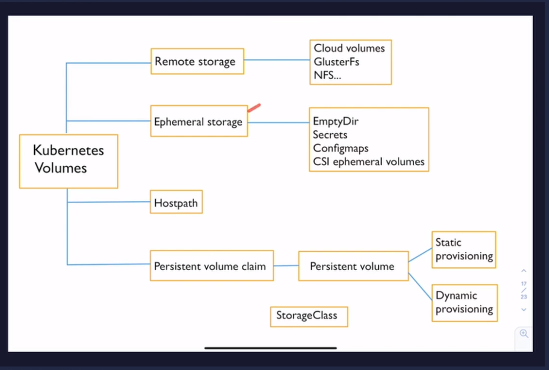
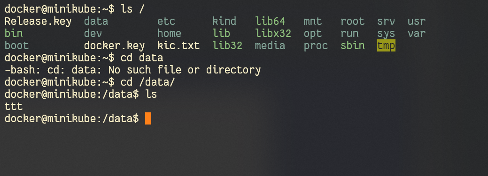
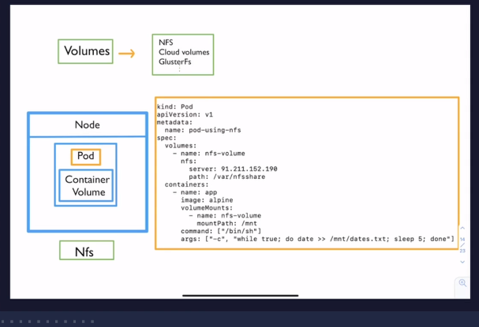
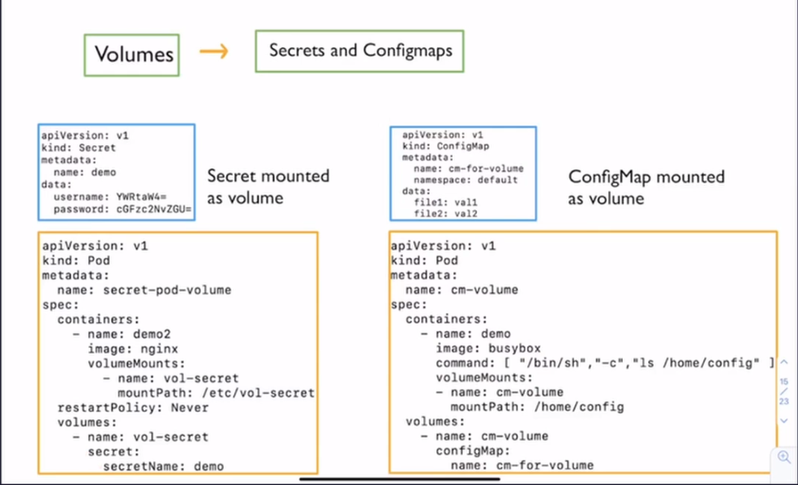
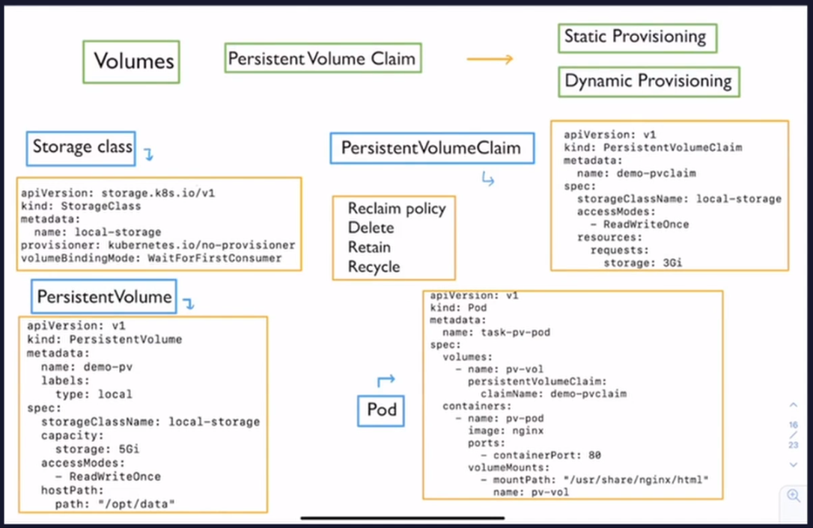

# Introduction



* Remote storage - the storage is external to the cluster if cluster does down the data persists
* Ephemeral storage - the data the containner requires when it is running i.e. secrets, caching, mounting, config map usage
* HostPath - it mounts the node's disk inside the container it is very much restricted inside the cluster so if the pod is spinned up in another node where host part is not there ⚠️ problems inconsistencies 
* last one is used to persist the data in k8s

[PVC]() - it is a volume plugin it talks to the [Persistent volume]() and takes that claims that persistent volume
[PV]() can be provisioned by the admin by 
1. [static way]() or 
2. [dynamic config]() based on the [storage class]()

## Emptydir
* ❌ Saving critical data
* gets created as soon as the pod is assigned t o the node
* stay throughout the life-span of the pod
* when pod deleted it also deleted
* used for the scratch space, some sorting algorithm, checkpointing of a log computation in the ram
- node's disk attached node
- if specify the emptyDir: {} medium over here instad of the {} 
then it will assign tempfs and assign the ram as the volume for that

```yml
containers:
- image: alpine
  name: emptydir-container
  command: ['sh', '-c', 'sleep 3000']
  volumeMounts:
  - mountPath: /demo # path where volume is mounted in this directry /demo/ 
    name: test-vol

volumes:
- name: test-vol
  emptyDir: {}
```

```bash
# to get the node where the pod is.
kubectl get pods -n volumes -o wide

# then go inside the node

# then docker ps and inspect that particular container
# there is a path
# cd into that you will see the file created in the pod

# extra info for delete
kubectl delete pod empty-dir-demo --force --grace-period 0
```

## Hostpath
* ❌ Saving critical data
* it mounts a file or a directory from node's file system into the pod
* a running container needs access to the docker internals (/var/lib/docker can be mounted) or c-advisiour can be run in the container
* to check whether a particular directory is there or not in Node if yes then only it will run
* used to access docker

```yml
containers:
- image: alpine
  name: hostpath-container
  command: ['sh', '-c', 'sleep 3000']
  volumeMounts:
  - mountPath: /demo 
    name: hp-volume

volumes:
- name: hp-volume
  hostPath:
    path: /data
    type: DirectoryOrCreate
```


# Remote storage


A [PersistentVolume]() (PV) is a piece of storage in the cluster that has been provisioned by an administrator or dynamically provisioned using Storage Classes. It is a resource in the cluster just like a node is a cluster resource. PVs are volume plugins like Volumes, but have a lifecycle independent of any individual Pod that uses the PV. This API object captures the details of the implementation of the storage, be that NFS, iSCSI, or a cloud-provider-specific storage system.

A [PersistentVolume Claim]() (PVC) is a request for storage by a user. It is similar to a Pod. Pods consume node resources and PVCs consume PV resources. Pods can request specific levels of resources (CPU and Memory). Claims can request specific size and access modes (e.g., they can be mounted ReadWriteOnce, ReadOnlyMany or ReadWriteMany, see AccessModes).

[Azure PV Disk for k8s](https://docs.microsoft.com/en-us/azure/aks/azure-disk-volume)

refer to the Azure/ dir

# Secrets and ConfigMaps

* Secrets stors the secret information like username and are mounted as a volume to a container

* configMaps are set of confugrations which are also mounted to the 


# Volumes

if in the [PVC]() there is [storage class]() then it is [Dynamic provisiong]() `otherwise` it is [Static provisiong]()

[PVC]() is created first witout [stroage class]()  then it is unbound and after this [PV]() is created then [PVC]() gets bounded to the [PV]() ->>> `STATIC PROVISIONING`

`DYNAMIC PROvISIONG` the stroage class / the [PV]() needed to be created by admin
after this the user creats a [PVC]() by mentioning about the what storage, its type  && corresponding [PV]() automatically gets created

### reclaim policy
1. delete - [PV]() deleted once the [PVC]() gets deleted
1. retain - [PV]() is retained when [PVC]() gets deleted
1. recycle - [PV]() can be used by another [PVC]()

## Storage class
defines What kind of storage will be provisioned when a [PVC]() created `dynamically provisioning`
incase of `static provisioning` we create the [PV]() manually

[PVC]() by the user user need not know all the details just ask for a particular storage capacity
with readWriteOnce / readWriteMany

[PVC]() is helpful when the pod goes down and a new pod Comes up on a different node Then also reduces the same [PVC]() as it different kubernetes object independent of pod lifecycle

