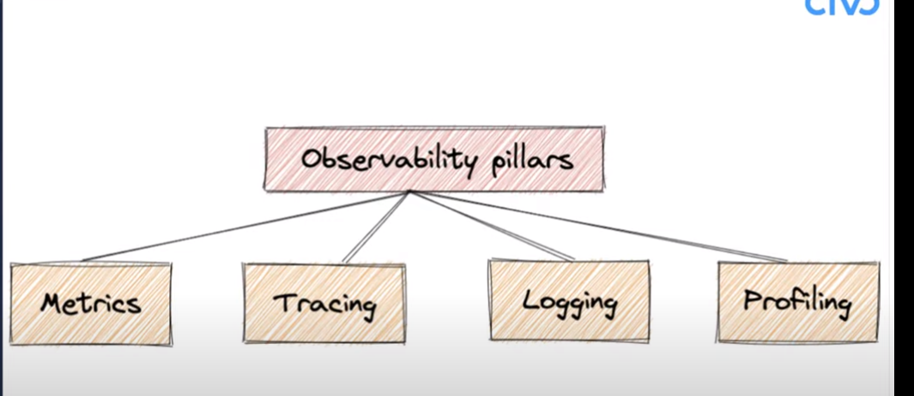
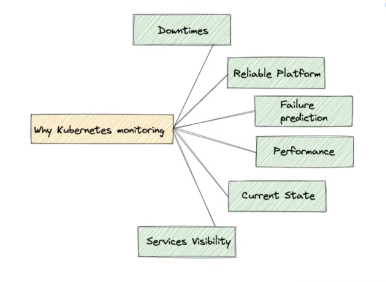
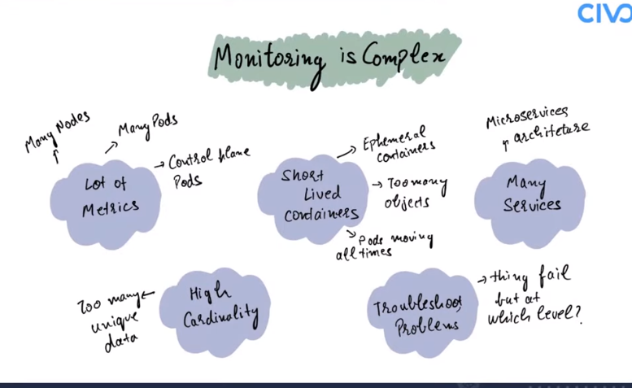
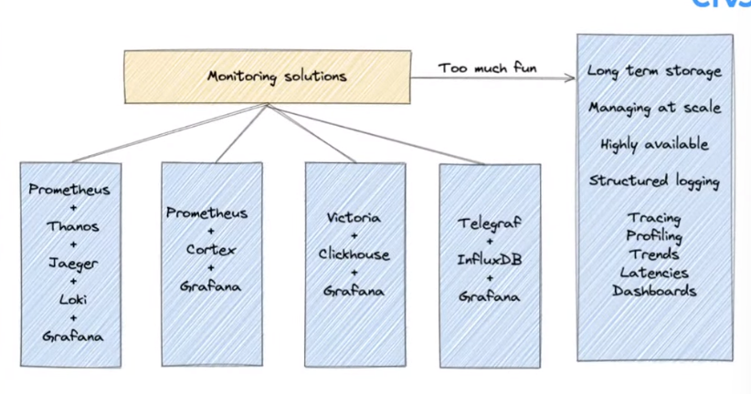
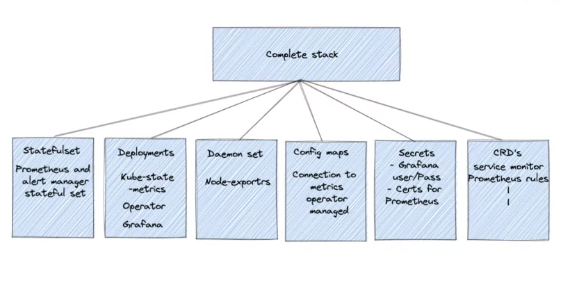
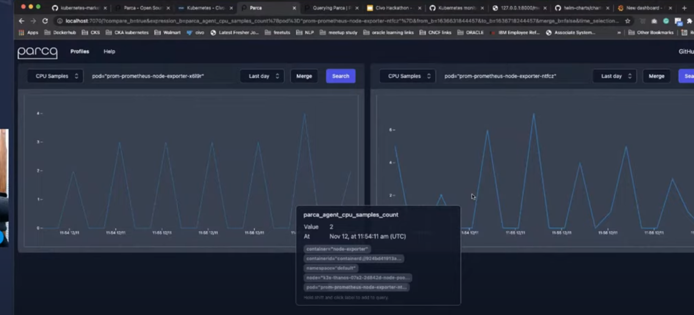

# Intro to Kubernetes monitoring - Civo Hackathon


## Observability pillars

- **Metrics**
  It is like time series data about memory and cpu usages and more
  k8s pod CPU and Mem usage
  system performance it haas alot of details
  After [Scraping]() the metrics we can analyze create graph and alert management
- **Tracing**
  When we are having alot of microservice
  like connections are lets say A->B->C->F->X
  we can trace the [requests]() and with this tracing we can find where the actual issue lies
  which microservice is slow to respond
- **Logging**
  log files
  debugging errors
  k8s has a lot of logs
  so we need [Structued logging]()
  Elastic, loki
- **Profiling**
  How this application is performing with respect to time
  continuous profiling of k8s objects like deploy, pods
  what is compare cpu & mem benchmarks between 2 applications


it is temporarty just to maintain the current state of the cluster



When there is high cardinality due to which it is hard for time series and database is difficult to query for longer duration
system halt

k8s is meant to have high cardianality due to all the very short lived containers which is also needed to be metric 
we need to have DSDB's



if you want to scrap metrics not only from k8s but also from other components
telegraf, influxDB, Grafana

we need to have highly available prometheus
down sample the data and store like highest cpu comsumption by a pod for a given day
promethus alone cannot do that
want logging, tracing solutions prometheus cannot do it itseld

thanos makes promethus highly available, long term storage
[Saiyam Gist](https://gist.github.com/saiyam1814)



```bash
helm repo add prometheus-community https://prometheus-community.github.io/helm-charts\n
helm repo update\n
helm install prom prometheus-community/kube-prometheus-stack

# checks the installs
kubectl get all
# grafana service
admin/prom-operator

# kubectl get sec - secrets
# kubectl get cm - Config maps

# import add dashboard  port or id : 1860

# generate after install 
kubectl --namespace default get pods -l "release=prom"
```

kubestate metrics monitors kuberenetes components but since 
node exporter will do a lot


⚠️ important parts are the stateful set
kube prometheus stack prometheus
which will be managed by the 
`kube prometheus stack operator(Deployment)` `Main Part`
and also maanages other congif maps

deamon set is the node exporter

when clusterIP is `None` means it is a headless service
it is used for statful sets

> so as to access Graphana we can edit its network to `NodePort`

⚠️important config map⚠️
prom-kube-prometheus-stack-prometheus


statefulsets managed by the operators


here comparing 2 nodes cpu utilising
