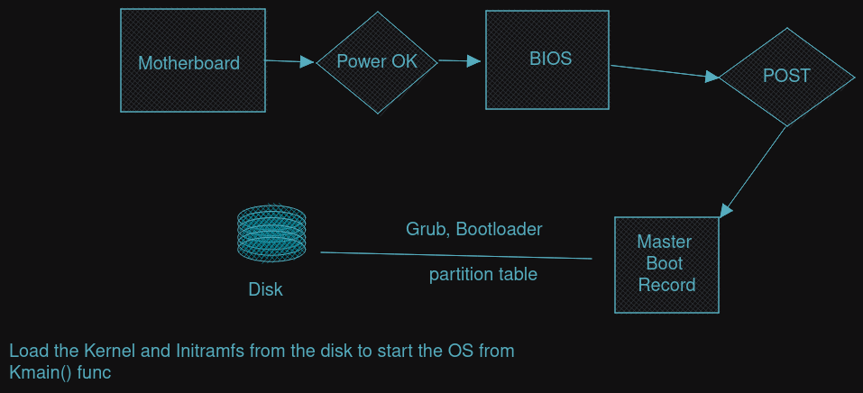
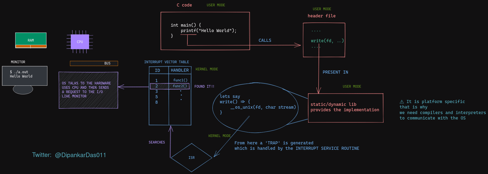
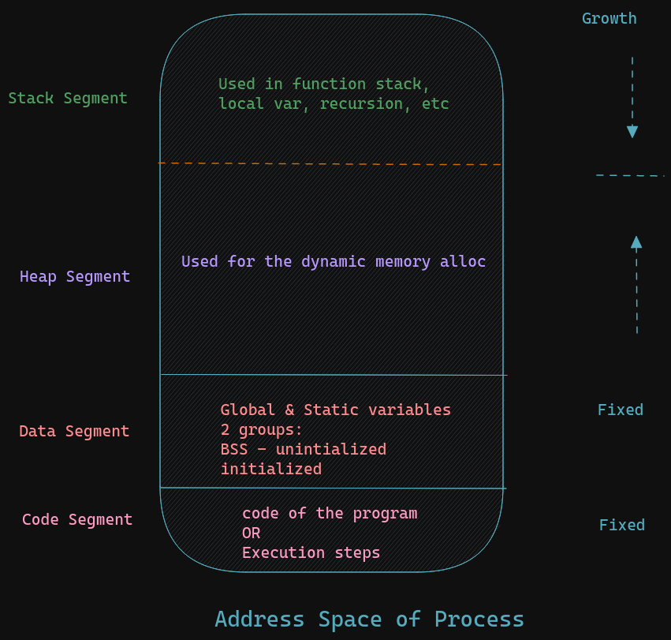
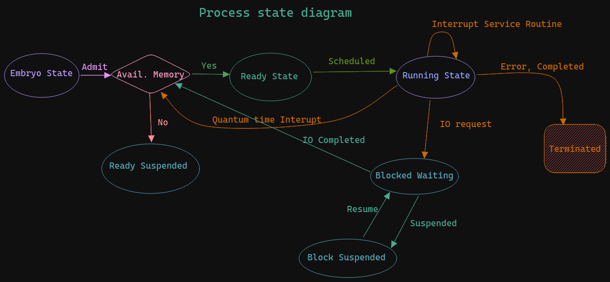

# Necessary concepts of Operating Systems for a software engineer

# What is it
Operating system is a set of programs which acts as a interface between User and Hardware. it is neccessary to reduce complexity

## Modes in a OS
1. User mode
2. Supervisor mode (i.e. Kernel mode)

user application are provided API's by OS to talk with the hardware.

How does the Computer Boots

 # TODO bootsequence

for example.
How the print statement is evaluated in a Operating System

## Components
1. Process management
1. File management
1. Memory management
1. I/O management

# What is Process 
--PCB--
a process is the instance of a computer program that is being executed by one or many threads.
OS represents each process tracked with PCB(Process Control Block)
* Process ID (**Linux** it is represented by 16 bits)
* Parent process ID
* Process state
* CPU State
* Scheduling information
* Memory information
* Open file information

## Components

1. OS Resources
it contains the information
* open file information
* socket information
* scheduling algorithm to be used
* PID,etc.

2. Address Space

3. CPU State
all the CPU register associated with the process
it stores the current state
PC=program Counter
IP=Instruction prointer
SP=stack pointer
it is useful when there is a context switch as CPU stores the current state of process into this segment
and after storing it then it switches to the new process

## Creating of New Process
we can use `fork()` to create a child process
its important to note that during fork() is invoked, the parent process address space is copied to the child process

## Zombie & Orphan Processes
Orphan Process - When the parent process gets completed before the child process then child process control is transfered to the *init* process in linux kernel and so the child has a parent process id of 1 or in more recent linux kernel it is 2 or 3
Zombie Process - When the parent process is busy in some I/O or in sleeping/suspending state then if the child process gets completed then the parent process does not know about

we can use the wait() in parent block so that parent waits for its child process to get terminated before it gets terminated

## InterProcess Communication(IPC)
Here we use a pipe structure to communicate between processes
it uses 2 heads a read and write

in Golang channel is used to communicate in a GoRoutine

# process scheduling

the program that takes the responsibility of moving process from one queue to another
## Types
1. Short Term Scheduler - it decides which process moves from Ready queue to Running state(CPU)
it is called by:-
  * Interrupt Service Routine
  * When a process terminates
  * I/O operation is invoked

1. Long Term Scheduler -  it decides which process moves from Embryo State/Ready_Suspended state to Ready Queue
1. Mid Term Scheduler - used for swap area. but some dont use as logn term can be extended to fit its purpose 

> Context switch - mechanism to change the control of the CPU from one process to another

> Premeptive - control can be transfered to another process even if the process is not completed 
> Non-premeptive - control can be transfered to another process when the process is completed

## Scheduling Algorithms
1. FCFS (First Come First Serve) [nonpremeptive]
the process which comes first gets the CPU first (arrivial time)

2. SJF (Shortest Job First) [premptive/nonpremptive]
it is not practical
scheduler decides according to the burst time required by the process

3. Priority based [premptive/nonpremptive]
each process is given priority
the lower priority process is given the preference

4. Round Robin [premptive]
Here there is fixed Quantum time
its like a circular queue where each process gets Qt amount of time, if not completed then it is reinserted at the back
and the process after this is given to the CPU
it has least waiting time. So used in interactive tasks (UI)

## Hybrid of these are there
5. Round Robin with priority
6. multilevel feedback Queue

# Thread
Its is lighweight process
Every thread uses the address space of its parent
it take significantly less time and resources as compared to creating a new child process
each thread has its own:
* PC
* CPU state
* Stack

the stack is stored in parent process Heap address space
## Types
* user thread - it is in user space and is handled by the programming language
* kernel thread - it is in kernel space and is handled by the Operating System
to execute a user thread it is tranfer to kernel threads to execute it

* Many-One
* One-Many
* One-One
* Many-Many

# Memory management

# deadlock

# concurrency

# memory

# IO
Buffer is used to speed up the process because the I/O significantly slower compared to the CPU so CPU had to wait.
* Single buffer
* Double Buffer
* circular buffer

# Conclusion