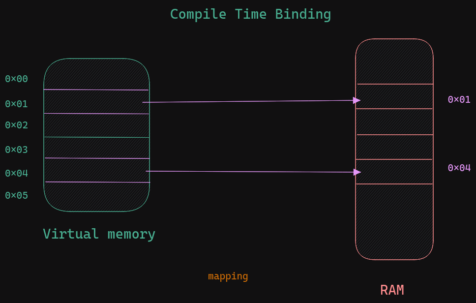
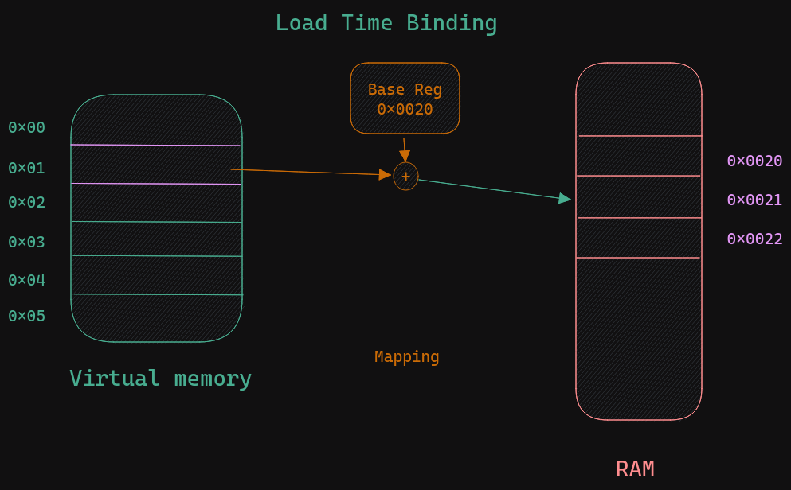

# Necessary concepts of Operating Systems for a software engineer

# What is it
Operating system is a set of programs which acts as a interface between User and Hardware. it is neccessary to reduce complexity

## Modes in a OS
1. User mode
2. Supervisor mode (i.e. Kernel mode)

user application are provided API's by OS to talk with the hardware.

How does the Computer Boots


for example.
How the print statement is evaluated in a Operating System


## Components
1. Process management
it manages the processes and there resources
1. File management
it manages the file Read, Write, Execute, Permissions and sharing
1. Memory management
it counts how much is free, makes memory available & dealloc, and memory isolation, mapping
1. I/O management
it handles interrupts, device drivers, bus, buffers, etc


# What is Process 
a process is the instance of a computer program that is being executed by one or many threads.
OS represents each process tracked with PCB(Process Control Block)
* Process ID (**Linux** it is represented by 16 bits)
* Parent process ID
* Process state
* CPU State
* Scheduling information
* Memory information
* Open file information

## Components

1. OS Resources
it contains the information
* open file information
* socket information
* scheduling algorithm to be used
* PID,etc.

2. Address Space

3. CPU State
all the CPU register associated with the process
it stores the current state
PC=program Counter
IP=Instruction prointer
SP=stack pointer
it is useful when there is a context switch as CPU stores the current state of process into this segment
and after storing it then it switches to the new process

## Creating of New Process
we can use `fork()` to create a child process
its important to note that during fork() is invoked, the parent process address space is copied to the child process

## Zombie & Orphan Processes
Orphan Process - When the parent process gets completed before the child process then child process control is transfered to the *init* process in linux kernel and so the child has a parent process id of 1 or in more recent linux kernel it is 2 or 3
Zombie Process - When the parent process is busy in some I/O or in sleeping/suspending state then if the child process gets completed then the parent process does not know about

we can use the wait() in parent block so that parent waits for its child process to get terminated before it gets terminated

## InterProcess Communication(IPC)
Here we use a pipe structure to communicate between processes
it uses 2 heads a read and write

in Golang channel is used to communicate in a GoRoutine

# process scheduling


the program that takes the responsibility of moving process from one queue to another
## Types
1. Short Term Scheduler - it decides which process moves from Ready queue to Running state(CPU)
it is called by:-
  * Interrupt Service Routine
  * When a process terminates
  * I/O operation is invoked

1. Long Term Scheduler -  it decides which process moves from Embryo State/Ready_Suspended state to Ready Queue
1. Mid Term Scheduler - used for swap area. but some dont use as logn term can be extended to fit its purpose 

> Context switch - mechanism to change the control of the CPU from one process to another
> Premeptive - control can be transfered to another process even if the process is not completed 
> Non-premeptive - control can be transfered to another process when the process is completed

## Scheduling Algorithms
1. FCFS (First Come First Serve) [nonpremeptive]
the process which comes first gets the CPU first (arrivial time)

2. SJF (Shortest Job First) [premptive/nonpremptive]
it is not practical
scheduler decides according to the burst time required by the process

3. Priority based [premptive/nonpremptive]
each process is given priority
the lower priority process is given the preference

to avoid starvation we can use the ageing method where at each clock cycle the priority of processes in queue are reduced

4. Round Robin [premptive]
Here there is fixed Quantum time
its like a circular queue where each process gets Qt amount of time, if not completed then it is reinserted at the back
and the process after this is given to the CPU
it has least waiting time. So used in interactive tasks (UI)

## Hybrid of these are there
5. Round Robin with priority
Here it compares the priority of runnnable process with other runnable processes
6. multilevel feedback Queue
ready queue is divided into >= 2 queues
1st queue = Highest Priority (Interractive processes like UI)
latest queue = Lowest priority (Background processes)
and other queue for the (system process)

# Thread
Its is lighweight process
Every thread uses the address space of its parent
it take significantly less time and resources as compared to creating a new child process
each thread has its own:
* PC
* CPU state
* Stack

the stack is stored in parent process Heap address space
## Types
* user thread - it is in user space and is handled by the programming language
* kernel thread - it is in kernel space and is handled by the Operating System
to execute a user thread it is tranfer to kernel threads to execute it

# Process Syncronization / Concurrency
There is problem when there are > 2 processes; excute simultaneously and using a common resources then there are inconsistencies
This is Race Condition

there are 3 steps in each process
```
acuire_lock()
----
Critical section # where all the program logic happens
----
release_lock()
``` 

## Solutions
1. Software Lock(Peterson's 2 process solution)
If there are P0 and P1 processes
then P0 gives chance to P1 and vice-versa therby maintaing consistency

```cpp
// Process 0
flag[0] = True
turn = 1;

while (flag[1] == True && turn == 1);
```

```cpp
// Process 1
flag[1] = True
turn = 0;

while (flag[0] == True && turn == 0);
```
limitations is only 2 process at a time

2. Semaphores
Semaphore is a variable along with 2 operators called wait() and signal() to achieve synchronous
  ### Types
  * Binary - only one process at a time can enter the critical section
  * Counting - more than one process at a time can enter the critical section
If one or more processes are waiting to get there turn thereby cpu burst time is wasted to check them so it is a spin lock situation
to overcome we need the waiting queue
## Bakery using semaphore
multiple producer can put there item to the rack, and multiple consumer can eat item

```cpp
// Producer
wait(empty)
  wait(mutex)
    insert(rack, p_item)
  signal(mutex)
signal(full)

// Consumer
wait(full)
  wait(mutex)
    remove(rack)
  signal(mutex)
signal(empty)

```

## Reader & Writer method
When one or more process enters as read mode then no process can enter as write mode in the critical section
and when write mode process is inside critical section no read mode process are allowed to enter
only 1 write mode by N read mode

```cpp
// writer
wait(wr)
  write()
signal(wr)

// reader
wait(mutex)
  count++
  if (count == 1)
    wait(wr)
signal(mutex)

read()

wait(mutex)
  count--
  if (count == 0)
    signal(wr)
signal(mutex)
```

## Dinning philosophere

philosophere
```
think()
# aquire_chopsticks
eat()
# release_chopsticks
```

```cpp

enum STATE{
  HUNGARY, EATING, THINKING
}
semaphore p[5] = {0}
mutex = 1
int state[5]

void philosopherWork(int i) {
  while (1) {
    think(i)
    takeChopsticks(i)
    eat(i)
    releaseChopsticks(i)
  }
}

void takeChopsticks(int i) {
  wait(mutex)
    state[i] = HUNGARY
    test(i)
  signal(mutex)
  signal(p[i])
}
// 4 Philosopheres
void test(int i) {
  if (state[i] == HUNGARY && state[(i+1) % 5] != EATING && state[(i+4) % 5] != EATING) {
    state[i] = EATING
    signal(p[i])
  }
}

void releaseChopsticks(int i) {
  wait(mutex)
    state[i] = THINKING
    test((i+1) % 5)
    test((i+4) % 5)
  signal(mutex)
}
```

3. Monitors
it is a high level programming language construct to achieve synchronous
Block
-----
lock
shared variable
atomic function
conditional variables


# Deadlock
a set of processes are said to be in deadlock if every process belongs to this set holds a resource and waiting for another resource which is currently held by other process belongs to this same set

## handling
1. Deadlock prevention - prior to deadlock
make anyone of the following true:
  * no mutual exclusion
  * no hold & wait
  * no preemtion
  * no circular wait

1. Deadlock avoidance - prior to deadlock
dynamically verify the resource allocation state
using
Allocated resource count, available resources, need of that process

single instatnce resource - resource allocation graph
multiple instance resource - bankers algorithm

1. Deadlock detection - deadlock occured
system has to know information required to find deadlock
* allocation
* request
* availability

* single instance resource - Wait for graph
* Multiple instance resource - Banker's algo

1. Deadlock recovery - deadlock occured
how to resolve it
* assume that there is no deadlock
  * resource preemption
  * process termination (all or some selected till it is deadlock free)

# Memory management
functions of it:-
* keep track of free space
* allocation memory to process whenever they need it
* protection of memory of one process from another

creation of executable file
* without linking
* with linking
  * static linking the libray files are added after linking process
  * dynamic linking the library file are fetches as needed during execution

> Virtual Memory - it is used to expanded the available memory resource than it is. 


## Mapping of instructions
--examples--
1. Compile time binding
each line mapped to the physical memory
Compiler must know where the space is available 


2. Load time binding
Base register is provided by the OS and 
Base register + index gives the physical memory


3. Execution time binding
during the execution the instruction can move from one memory location to another

## Types of allocation
* Monoprogramming systems (compile time binding )
* multiprogramming 
  * Contigous
    1. fixed partioning
      whole memory is divided in fixed sized chunks
      it causes internal fragmentation
    1. variable partioning
      it is not divied but the program is stored in continuous memory location of its size
      it causes external fragmentation
  * Non contiguous
    it solves the external fragmenation
    TODO: start from here
    > logical address
    > page table
    > RAM
    
    1. paging
      1. Single page table
      1. Multiple page table
    1. segmentation
## additional bits
- valid bit
1 -> valid if the page is used by the program
otherwise 0

- protection bit
read, write, execute
code segment must be read, execute
data segment must be read, write
- Reference bit
whether this page is curently accessed in CPU or not 
even reading or writing is known here as refered
- dirty bit
if that page is modified in in the ram but not written back to the virtual memory then dirty bit is set to 1
so when the page has to be removed from the ram then:
if the dirty bit == 1 then
  it is saved to the swap area
else
  it is saved to the hard drive

> TLB (translation look aside buffer)

## Replacement algo
1. FIFO - the first one in has to be replaced
1. optimal - in the near future whichever page is not going to be used
1. LRU - replace with the page which hs not been used recently
1. Approx LRU
  * uses the reference bit
  * if reference bit = 0 then replace it; otherwise not
1. additional refernce bit algo
1. second chance algo
1. Counting Algo

# IO
## Disk
1. sector/block
2. Head
3. track
4. cylinder

## Scheduling in Disk

## How files are stored (Linux File System) 

Buffer is used to speed up the process because the I/O significantly slower compared to the CPU so CPU had to wait.
* Single buffer
* Double Buffer
* circular buffer

# Protections & security


# Conclusion