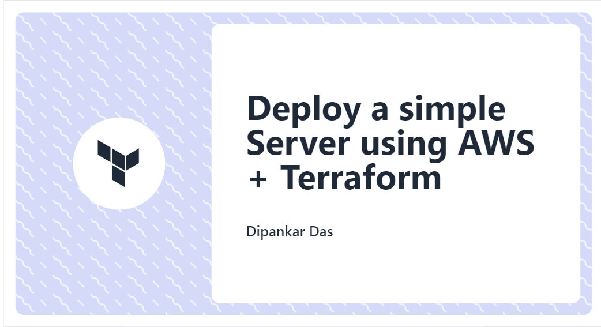
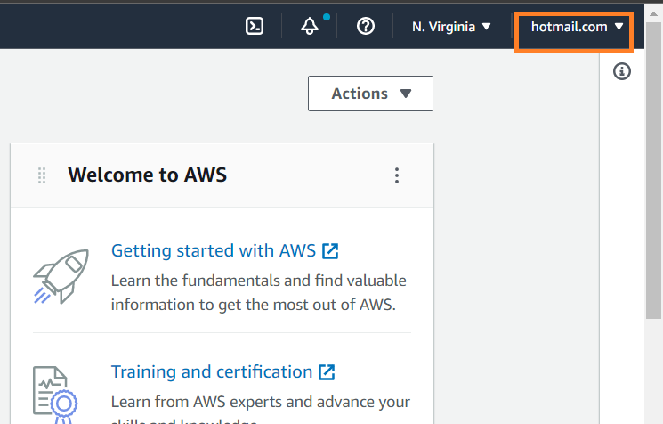
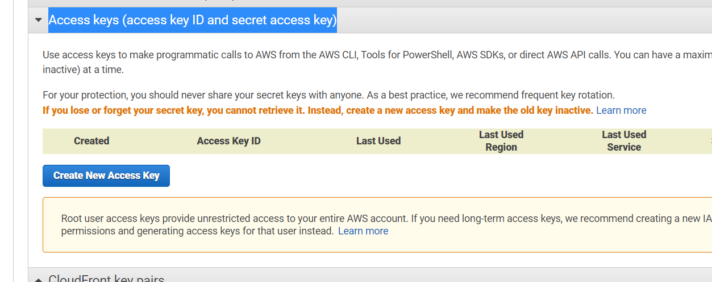
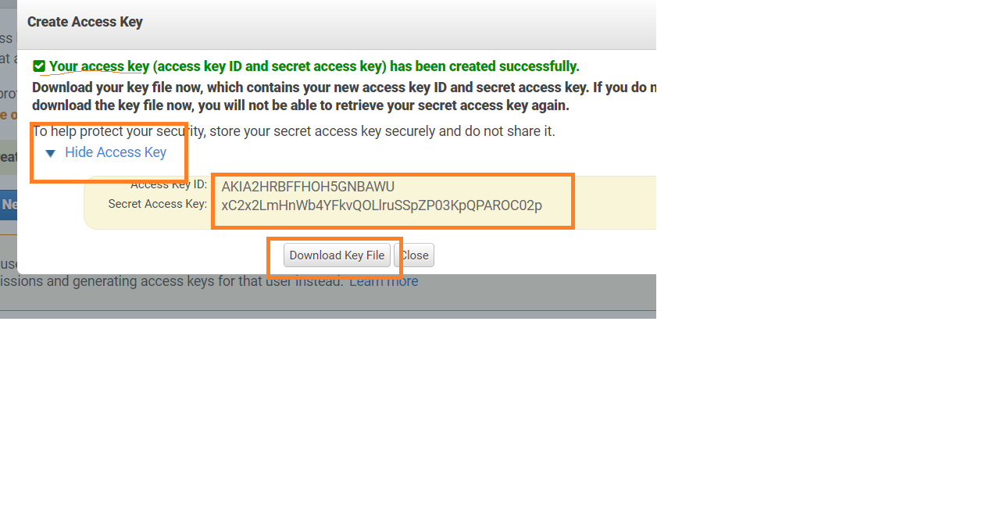
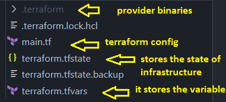
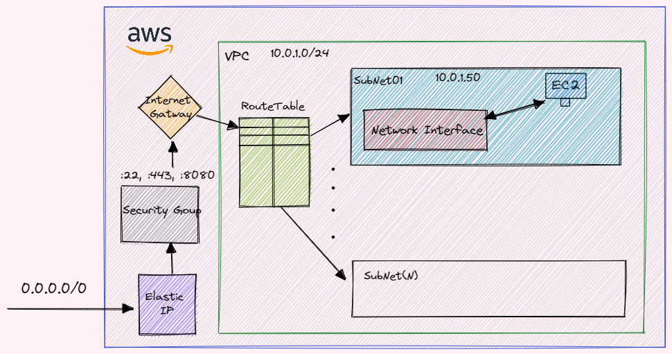
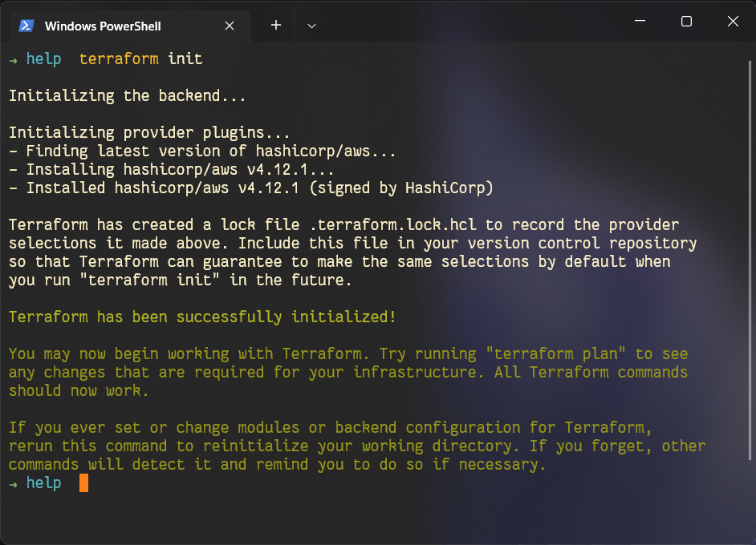
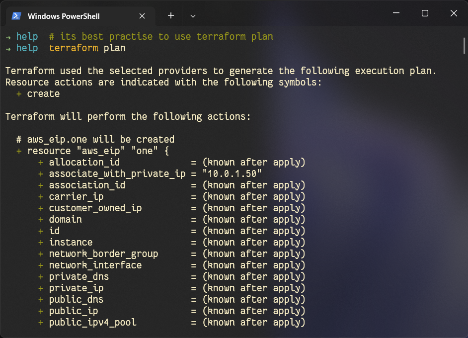
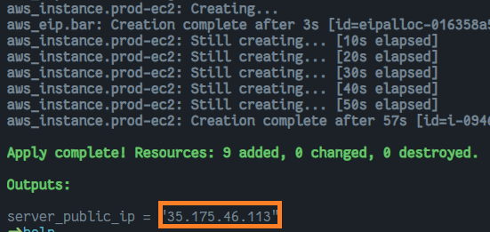
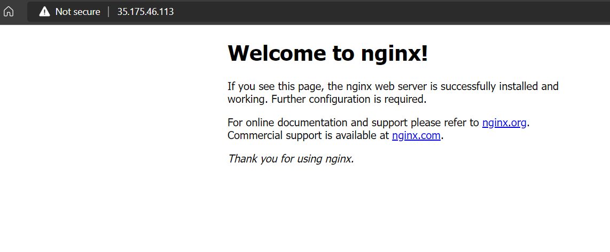

# Deploy a simple server using AWS + Terraform

# Define

## What is Terraform?
Terraform is an (**IAC**)infrastructure as code tool that lets you define both cloud and on-prem resources in human-readable configuration files that you can version, reuse, and share. 


## The core Terraform workflow
* Write: You define resources, which may be across multiple cloud providers and services. For example, you might create a configuration to deploy an application on virtual machines in a Virtual Private Cloud (VPC) network with security groups and a load balancer.
* Plan: Terraform creates an execution plan describing the infrastructure it will create, update, or destroy based on the existing infrastructure and your configuration.
* Apply: On approval, Terraform performs the proposed operations in the correct order, respecting any resource dependencies. For example, if you update the properties of a VPC and change the number of virtual machines in that VPC, Terraform will recreate the VPC before scaling the virtual machines.

[Link for the AWS resource definitions](https://registry.terraform.io/providers/hashicorp/aws/latest/docs)

# How to setup AWS
## Setup Access Key

1. To create one or more IAM users (console)
  1. Sign in to the AWS Management Console and open the IAM console at [**AWS IAM**](https://console.aws.amazon.com/iam/)
  2. expand the list **Access keys (access key ID and secret access key)** 
  3. **Store the keys**  
2. Installation of Terraform CLI
  [Download Link](https://www.terraform.io/downloads)



# Lets Learn by Doing
Lets get right into it

## Resources to create web server
1. EC2 - virtual machine
2. VPC - Virtual Private Cloud
3. Internet Gateway - to allow network traffic to reach the inside vpc
4. Subnet - It creates Network inside VPC thus reducing the network hopping
5. RouteTable - It stores destination addr where network traffic from your subnet or gateway is to be directed to.
6. Associate the RouteTable and Subnet - connect both of them
7. Security Group - to Allow which port and from what Client ip address it came
8. Network Interface - It allows communications between computers connected to the Subnet
9. Elastic IP - its a service by AWS which provides the dynamic IP during creation.



## Lets create simple resource

## terraform.tfvars
```terraform
client-ip-access = {
  ssh = "0.0.0.0/0"
  https = "0.0.0.0/0"
}
```

## main.tf
```terraform
provider "aws" {
  region  = "us-east-1"
  access_key = "<provide the key>"
  secret_key = "<provide the key>"
}


# vpc
resource "aws_vpc" "prod-vpc" {
  cidr_block = "10.0.0.0/16"
  tags = {
    Name = "prod-vpc"
  }
}

# internet gateway
resource "aws_internet_gateway" "gw" {
  vpc_id = aws_vpc.prod-vpc.id

  tags = {
    Name = "prod-gateway"
  }
}

# route table
resource "aws_route_table" "prod-rt" {
  vpc_id = aws_vpc.prod-vpc.id

  route {
    cidr_block = "0.0.0.0/0" # any ip can access
    gateway_id = aws_internet_gateway.gw.id
  }

  route {
    ipv6_cidr_block        = "::/0"
    gateway_id = aws_internet_gateway.gw.id
  }

  tags = {
    Name = "prod-rt"
  }
}

# subnets
resource "aws_subnet" "prod-subnet" {
  vpc_id     = aws_vpc.prod-vpc.id
  cidr_block = "10.0.1.0/24"
  availability_zone = "us-east-1a"

  tags = {
    Name = "prod-subnet"
  }
}

# join subnets and route table by association
resource "aws_route_table_association" "a" {
  subnet_id      = aws_subnet.prod-subnet.id
  route_table_id = aws_route_table.prod-rt.id
}

variable "client-ip-access" {
  description = "ip address for the client to access the host"
  type = map(string)
}

# security
resource "aws_security_group" "allow_http" {
  name        = "allow-web-traffic"
  description = "Network traffic allowed"
  vpc_id      = aws_vpc.prod-vpc.id

  ingress {
    description      = "HTTPS"
    from_port        = 443
    to_port          = 443
    protocol         = "tcp"
    cidr_blocks      = ["0.0.0.0/0"] # so as to make anyone to reach the server
  }

  ingress {
    description      = "HTTP"
    from_port        = 80
    to_port          = 80
    protocol         = "tcp"
    cidr_blocks      = ["0.0.0.0/0"] # so as to make anyone to reach the server
  }

  ingress {
    description      = "SSH"
    from_port        = 22
    to_port          = 22
    protocol         = "tcp"
    cidr_blocks      = ["0.0.0.0/0"] # so as to make anyone to reach the server
  }

  egress {
    from_port        = 0
    to_port          = 0
    protocol         = "-1"
    cidr_blocks      = ["0.0.0.0/0"]
  }

  tags = {
    Name = "prod-security"
  }
}

# elastic ip
# It's recommended to denote that the AWS Instance or Elastic IP depends on the Internet Gateway. For example:
resource "aws_eip" "bar" {
  vpc = true

  associate_with_private_ip = "10.0.1.50"
  network_interface = aws_network_interface.prod-nic.id
  depends_on                = [aws_internet_gateway.gw]

  tags = {
    "Name" = "prod-eip"
  }
}

# network interface
resource "aws_network_interface" "prod-nic" {
  subnet_id       = aws_subnet.prod-subnet.id
  private_ips     = ["10.0.1.50"]
  security_groups = [aws_security_group.allow_http.id]

  tags = {
    "Name" = "prod-nic"
  }
}

# ec2
resource "aws_instance" "prod-ec2" {
  ami           = "ami-04505e74c0741db8d" 
  instance_type = "t2.micro"
  availability_zone = "us-east-1a"

  network_interface {
    network_interface_id = aws_network_interface.prod-nic.id
    device_index         = 0
  }

  tags = {
    "Name" = "prod-ec2"
  }

  key_name = "terraform-access-ec2"

  user_data = <<-EOF
    #!/bin/bash
    sudo apt update -y
    sudo apt install apache2 -y
    sudo systemctl start apache2
    sudo bash -c 'echo your very first web server > /var/www/html/index.html'
    EOF
}

output "server_public_ip" {
  value = aws_eip.bar.public_ip
}
```

# Lets Deploy


```bash
terraform init
```


```bash
terraform apply
```




# References
* [Terraform Blog](https://kubesimplify.com/introduction-to-terraform)
* [Terrafrom in 2 hours (freecodecamp)](https://youtu.be/SLB_c_ayRMo)


Hope it helps
Happy coding👍🏼🥳